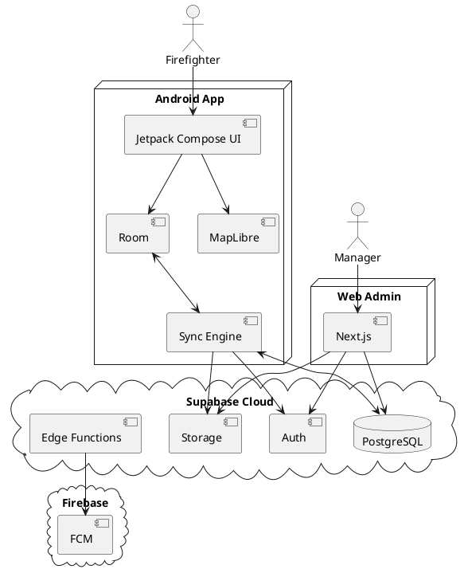
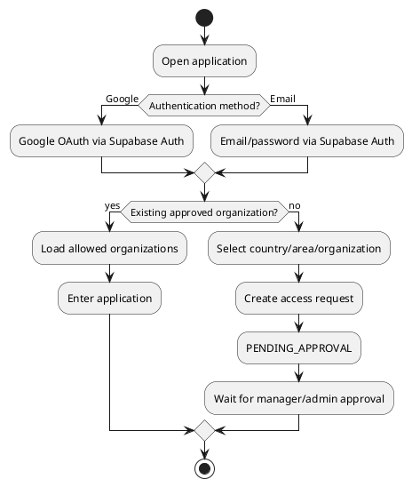
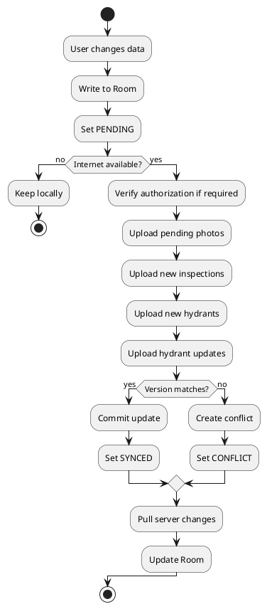

# SPEC-1-Hydrant-Management-Platform

**Status:** MVP specification\
**Purpose:** Source of truth for implementation by Codex or another
coding agent\
**Primary clients:** Android field application + Web administration
portal\
**Central backend:** Supabase Cloud\
**Languages (MVP):** Slovenian (`sl`) and German (`de`)

------------------------------------------------------------------------

## Background

Fire departments, municipalities, water utilities, and other authorized
organizations need a simple way to record, inspect, update, and locate
fire hydrants in the field.

The platform consists of an Android application for field work and a web
administration portal. Users can display hydrants on a map, add hydrants
using GPS or manual location entry, perform inspections, record
measurements and defects, attach photographs, scan QR codes, and
maintain a complete inspection history.

The Android application must remain useful without internet access.
Hydrants, inspections, photographs awaiting upload, and offline maps are
stored locally and synchronized with the central Supabase backend when
connectivity returns.

Primary users:

-   firefighters;
-   fire departments;
-   municipal workers;
-   water utility / infrastructure managers;
-   system and organization administrators.

The architecture must be modular so that future modules such as
vehicles, equipment, buildings, training, documentation, or
incident-related functionality can be added without redesigning the
hydrant module.

------------------------------------------------------------------------

## Requirements

### Must Have

-   Android application and responsive web administration portal.
-   Central cloud database; no customer-operated local server is
    required.
-   Supabase PostgreSQL is the system of record.
-   Android must support offline-first field work.
-   Previously synchronized hydrants must be available offline.
-   Map data for the user's organization area must be available offline.
-   A hydrant can be created with:
    -   current GPS position;
    -   a point selected on the map;
    -   manually entered latitude/longitude;
    -   manually entered address/location description without
        coordinates.
-   Hydrant types are configurable. Initial types:
    -   above-ground (`ABOVE_GROUND`);
    -   underground (`UNDERGROUND`);
    -   wall (`WALL`);
    -   other (`OTHER`).
-   Hydrant status:
    -   `WORKING`;
    -   `NOT_WORKING`;
    -   `NEEDS_INSPECTION`;
    -   `UNKNOWN`.
-   Each hydrant has an internal UUID and, after synchronization, a
    human-readable unique code such as `LJ-H-000123`.
-   QR codes can identify hydrants using a deep link such as
    `hydrant://LJ-H-000123`.
-   Inspection history must never be overwritten.
-   Inspection data supports:
    -   status;
    -   accessibility;
    -   visible damage;
    -   damage description;
    -   pressure in bar;
    -   flow in litres/minute;
    -   notes;
    -   inspection time;
    -   inspector.
-   Measurements are optional unless an organization later configures
    them as required.
-   1--5 inspection photographs.
-   Separate permanent hydrant photographs and inspection photographs.
-   Photographs must be captured/staged offline and uploaded later.
-   Users belong to one or more organizations.
-   Roles:
    -   `FIREFIGHTER`;
    -   `MANAGER`;
    -   `ADMIN`.
-   Firefighters may create hydrants directly; no approval workflow is
    required for new hydrants.
-   New user access may require organization approval.
-   Authentication:
    -   email/password;
    -   Google sign-in.
-   Google sign-in alone does not grant organization access.
-   New users select geographic/organizational context and request
    access.
-   Account states:
    -   `PENDING_APPROVAL`;
    -   `ACTIVE`;
    -   `SUSPENDED`;
    -   `REJECTED`.
-   Multi-country and hierarchical administrative areas.
-   Slovenian and German UI in MVP.
-   Configurable user start screen:
    -   Dashboard;
    -   Map;
    -   Inspections.
-   Configurable inspection UI:
    -   `QUICK`;
    -   `GUIDED`;
    -   `CLASSIC`.
-   Search by hydrant code, address, and location description.
-   Filters by type, status, organization, inspection state, and
    distance.
-   Nearby hydrants: 500 m, 1 km, 5 km, 10 km, or unrestricted.
-   Nearby calculation must work offline.
-   Configurable inspection interval per organization with optional
    per-hydrant override.
-   Inspection states:
    -   `OK`;
    -   `DUE_SOON`;
    -   `OVERDUE`;
    -   `NEVER_INSPECTED`.
-   CSV and XLSX import with validation and preview.
-   CSV and XLSX export.
-   Audit trail for important administrative and hydrant changes.
-   Push notifications.
-   Clear synchronization status in Android.
-   Conflict detection for concurrent offline edits.
-   Maximum 30 days of offline access since last successful online
    authorization verification.
-   Row Level Security must enforce organization isolation.
-   Automated CI/CD and security tests.

### Should Have

-   Dashboard metrics for hydrant condition and inspection deadlines.
-   Configurable notification preferences.
-   Automatic photograph optimization.
-   Organization polygon used to determine automatic offline download
    area.
-   Automatic retry of failed synchronization.
-   Conflict resolution UI.
-   Audit history visible to authorized managers/admins.
-   User-selectable Wi-Fi/mobile-data synchronization preferences.

### Could Have

Future modules may include:

-   fire vehicles;
-   equipment;
-   buildings;
-   other water sources;
-   maintenance;
-   training;
-   documents;
-   incident information;
-   additional languages.

### Won't Have --- MVP

The MVP is not an incident-command, firefighter-tracking, dispatch, or
team-communications system.

------------------------------------------------------------------------

## Method

### 1. High-Level Architecture



Supabase is the central source of truth. Room is an offline cache and
write queue, not a separate server.

### 2. Technology Stack

#### Android

-   Kotlin
-   Jetpack Compose
-   Material 3
-   Coroutines / Flow
-   Room
-   WorkManager
-   MapLibre
-   Supabase Kotlin client
-   Firebase Cloud Messaging
-   Android Keystore

Architecture:

``` text
Compose UI
    ↓
ViewModel
    ↓
Repository
    ↓
Room ←→ Sync Engine ←→ Supabase
```

The UI must not write directly to Supabase.

#### Web

-   Next.js
-   TypeScript
-   Supabase
-   MapLibre
-   server-side privileged operations only where required

#### Backend

-   Supabase PostgreSQL
-   Supabase Auth
-   Supabase Storage
-   Row Level Security
-   Supabase Edge Functions where trusted server-side logic is required

### 3. Geographic Hierarchy

The model must support multiple countries and varying administrative
structures.

Examples:

``` text
Slovenia
└── Region
    └── Municipality
        └── Fire Department
```

``` text
Austria
└── Bundesland
    └── Bezirk
        └── Gemeinde
            └── Feuerwehr
```

`administrative_areas.parent_id` provides an arbitrary hierarchy.

### 4. Core PostgreSQL Schema

The following is the target logical schema. SQL migrations are
authoritative.

#### `countries`

  Column   Type      Constraints
  -------- --------- ------------------
  id       UUID      PK
  code     CHAR(2)   UNIQUE, NOT NULL
  name     TEXT      NOT NULL
  active   BOOLEAN   DEFAULT TRUE

#### `administrative_areas`

  Column       Type
  ------------ -----------------------------------
  id           UUID PK
  country_id   UUID FK countries
  parent_id    UUID NULL FK administrative_areas
  name         TEXT NOT NULL
  area_type    TEXT NOT NULL
  boundary     JSONB NULL
  active       BOOLEAN DEFAULT TRUE

For production spatial queries, PostGIS geometry may replace or
supplement JSONB boundaries.

#### `organizations`

  Column                       Type
  ---------------------------- -----------------------------
  id                           UUID PK
  administrative_area_id       UUID NULL
  name                         TEXT NOT NULL
  code                         TEXT NOT NULL
  type                         TEXT NOT NULL
  inspection_interval_months   INTEGER NOT NULL DEFAULT 12
  default_language             TEXT
  active                       BOOLEAN DEFAULT TRUE
  created_at                   TIMESTAMPTZ
  updated_at                   TIMESTAMPTZ

Organization types include `MUNICIPALITY`, `FIRE_DEPARTMENT`,
`WATER_UTILITY`, `OTHER`.

#### `profiles`

  Column               Type
  -------------------- --------------------------------
  id                   UUID PK, references auth.users
  display_name         TEXT
  email                TEXT
  account_status       TEXT NOT NULL
  preferred_language   TEXT
  start_screen         TEXT DEFAULT 'DASHBOARD'
  inspection_mode      TEXT DEFAULT 'GUIDED'
  created_at           TIMESTAMPTZ
  updated_at           TIMESTAMPTZ

#### `user_organizations`

  Column            Type
  ----------------- ---------------
  user_id           UUID
  organization_id   UUID
  role              TEXT NOT NULL
  created_at        TIMESTAMPTZ

Primary key: `(user_id, organization_id)`.

#### `organization_access_requests`

  Column            Type
  ----------------- ----------------------
  id                UUID PK
  user_id           UUID NOT NULL
  organization_id   UUID NOT NULL
  requested_role    TEXT
  status            TEXT NOT NULL
  requested_at      TIMESTAMPTZ NOT NULL
  reviewed_by       UUID NULL
  reviewed_at       TIMESTAMPTZ NULL

#### `hydrant_types`

  Column            Type
  ----------------- ----------------------
  id                UUID PK
  organization_id   UUID NULL
  code              TEXT NOT NULL
  name              TEXT NOT NULL
  active            BOOLEAN DEFAULT TRUE

Global initial types may have `organization_id = NULL`.

#### `hydrants`

  Column                       Type
  ---------------------------- ---------------------------------
  id                           UUID PK
  code                         TEXT UNIQUE NULL
  organization_id              UUID NOT NULL
  hydrant_type_id              UUID NOT NULL
  latitude                     DECIMAL(9,6) NULL
  longitude                    DECIMAL(9,6) NULL
  address                      TEXT NULL
  location_description         TEXT NULL
  status                       TEXT NOT NULL DEFAULT 'UNKNOWN'
  notes                        TEXT NULL
  inspection_interval_months   INTEGER NULL
  active                       BOOLEAN DEFAULT TRUE
  version                      BIGINT NOT NULL DEFAULT 1
  created_by                   UUID NOT NULL
  created_at                   TIMESTAMPTZ NOT NULL
  updated_by                   UUID NULL
  updated_at                   TIMESTAMPTZ NOT NULL

A hydrant may exist without coordinates if an address/location
description is supplied.

#### `inspections`

  Column               Type
  -------------------- ----------------------
  id                   UUID PK
  hydrant_id           UUID NOT NULL
  inspector_id         UUID NOT NULL
  status               TEXT NOT NULL
  inspected_at         TIMESTAMPTZ NOT NULL
  accessible           BOOLEAN NULL
  visible_damage       BOOLEAN NULL
  damage_description   TEXT NULL
  pressure_bar         DECIMAL(5,2) NULL
  flow_l_min           DECIMAL(8,2) NULL
  notes                TEXT NULL
  created_at           TIMESTAMPTZ NOT NULL
  updated_at           TIMESTAMPTZ NOT NULL

Inspections are append-only from the normal application workflow.

#### `hydrant_photos`

  Column         Type
  -------------- -----------------------
  id             UUID PK
  hydrant_id     UUID NOT NULL
  storage_path   TEXT NOT NULL
  created_by     UUID NOT NULL
  created_at     TIMESTAMPTZ NOT NULL
  is_primary     BOOLEAN DEFAULT FALSE

#### `inspection_photos`

  Column          Type
  --------------- ----------------------
  id              UUID PK
  inspection_id   UUID NOT NULL
  storage_path    TEXT NOT NULL
  created_by      UUID NOT NULL
  created_at      TIMESTAMPTZ NOT NULL

#### `sync_conflicts`

  Column            Type
  ----------------- ----------------------
  id                UUID PK
  organization_id   UUID NOT NULL
  entity_type       TEXT NOT NULL
  entity_id         UUID NOT NULL
  field_name        TEXT NOT NULL
  local_value       JSONB
  server_value      JSONB
  local_user_id     UUID
  server_user_id    UUID
  detected_at       TIMESTAMPTZ NOT NULL
  resolved_at       TIMESTAMPTZ NULL
  resolved_by       UUID NULL
  resolution        TEXT NULL

#### `audit_log`

  Column            Type
  ----------------- ----------------------
  id                UUID PK
  organization_id   UUID NULL
  user_id           UUID NOT NULL
  action            TEXT NOT NULL
  entity_type       TEXT NOT NULL
  entity_id         UUID NULL
  old_data          JSONB
  new_data          JSONB
  created_at        TIMESTAMPTZ NOT NULL

#### `notification_preferences`

  Column                Type
  --------------------- ---------
  user_id               UUID PK
  hydrant_not_working   BOOLEAN
  inspection_overdue    BOOLEAN
  inspection_due_soon   BOOLEAN
  hydrant_changes       BOOLEAN
  sync_errors           BOOLEAN

#### `device_tokens`

  Column         Type
  -------------- ----------------------
  id             UUID PK
  user_id        UUID NOT NULL
  device_token   TEXT NOT NULL
  platform       TEXT NOT NULL
  active         BOOLEAN DEFAULT TRUE
  created_at     TIMESTAMPTZ
  last_seen_at   TIMESTAMPTZ

### 5. Hydrant Code Generation

The UUID is the true identifier.

Offline devices must not independently allocate final sequential codes.
A newly created offline hydrant uses its UUID and displays a temporary
state such as:

`New hydrant — waiting for synchronization`

During first successful server synchronization, trusted database/server
logic atomically allocates a code such as:

`LJ-H-000124`

The allocation must be concurrency-safe and idempotent.

### 6. Authentication and Authorization



Google authentication verifies identity; it does not grant organization
access.

RLS must enforce organization membership on every protected table and
Storage object. The browser and Android app must never contain a
Supabase `service_role`/secret key.

### 7. Role Model

`FIREFIGHTER`

-   view authorized hydrants;
-   add hydrants;
-   perform inspections;
-   change operational status through inspection workflow.

`MANAGER`

-   firefighter permissions;
-   edit hydrant master data;
-   deactivate hydrants;
-   manage relevant operational data;
-   approve organization access where configured.

`ADMIN`

-   all manager permissions;
-   user/role administration;
-   organization settings;
-   system administration within allowed scope.

### 8. Offline Authorization

Android stores `last_online_verification_at`.

Offline access is allowed for at most 30 days after successful online
authorization verification.

Warnings:

-   7 days before expiry;
-   1 day before expiry.

After expiry, organization data is locked until the application
successfully verifies the account and current memberships online.

Revocation cannot be guaranteed while a device is physically offline; 30
days is the maximum stale authorization period.

### 9. Offline Data Model and Synchronization

Room stores at minimum:

-   organizations;
-   hydrant types;
-   hydrants;
-   inspections;
-   photo metadata;
-   pending changes.

Local sync states:

-   `PENDING`;
-   `SYNCING`;
-   `SYNCED`;
-   `FAILED`;
-   `CONFLICT`.



Pending data must never be deleted before server acknowledgement.

All create operations must be idempotent using client-generated UUIDs.

### 10. Conflict Rules

Inspections never overwrite one another. Two independent inspections are
both retained.

Hydrant master-data updates use optimistic concurrency via
`hydrants.version`.

Example:

-   device downloaded version 14;
-   server is now version 15;
-   device submits update expecting 14;
-   update is rejected as conflict;
-   both values are retained in conflict metadata for resolution.

No silent last-write-wins for conflicting master-data edits.

### 11. Inspection Deadline

Effective interval:

``` text
hydrant.inspection_interval_months
    ?? organization.inspection_interval_months
```

Next inspection:

``` text
last_valid_inspection.inspected_at + effective_interval
```

If no inspection exists: `NEVER_INSPECTED`.

`DUE_SOON` default threshold: 30 days.

### 12. Android Navigation

Default bottom navigation:

-   Home;
-   Map;
-   QR;
-   Inspections;
-   More.

Dashboard is the default start screen.

Users can select:

-   `DASHBOARD`;
-   `MAP`;
-   `INSPECTIONS`.

Dashboard must be modular and must not be hard-coded exclusively around
hydrants.

### 13. Inspection Modes

#### QUICK

Minimum field workflow:

-   status;
-   optional photo;
-   optional note.

#### GUIDED

Steps:

1.  status;
2.  accessibility;
3.  damage;
4.  measurements;
5.  photographs;
6.  note;
7.  review;
8.  finish.

#### CLASSIC

All fields on a single form.

All three modes persist the same `inspections` schema.

### 14. Map and Offline Map

MapLibre is used for map rendering.

The application automatically downloads an offline map area based on the
user's authorized organization geography.

Public OpenStreetMap tile infrastructure must not be used for prohibited
bulk/offline downloading. The implementation must use a tile/style
provider whose terms permit the intended offline use, or a separately
operated map tile service.

Android offline capabilities:

-   base map;
-   roads/settlements contained in downloaded map package;
-   hydrant markers;
-   GPS position;
-   map filters;
-   creation of a point;
-   nearby hydrants.

### 15. Nearby Hydrants

Distance is calculated locally using stored coordinates and current
device coordinates.

MVP uses Haversine/geodesic distance sufficient for radius filtering.

A hydrant without coordinates is excluded from nearby results but
remains searchable.

The user's live location is not centrally tracked solely for this
feature.

### 16. Photographs

Two categories:

-   hydrant photos;
-   inspection photos.

Before upload:

-   maximum long edge approximately 1920 px;
-   preserve aspect ratio;
-   JPEG/WebP compression;
-   remove unnecessary EXIF metadata;
-   preserve correct orientation.

Target typical size: approximately 200--800 KB.

Storage layout:

``` text
hydrants/
  {organization_uuid}/
    {hydrant_uuid}/
      main/
        {photo_uuid}.webp
      inspections/
        {inspection_uuid}/
          {photo_uuid}.webp
```

Unsynchronized local photographs must never be automatically removed.

### 17. Search and Filters

Offline-capable search:

-   code;
-   address;
-   location description.

Filters:

-   hydrant type;
-   hydrant status;
-   inspection state;
-   organization;
-   distance.

### 18. Import

Web admin supports CSV and XLSX.

Typical columns:

  code   type     latitude   longitude address   status
  ------ ------ ---------- ----------- --------- --------

Before import:

1.  select organization;
2.  upload;
3.  parse;
4.  validate;
5.  preview;
6.  show valid/warning/error counts;
7.  confirm;
8.  persist.

Validate at least:

-   coordinates;
-   type;
-   status;
-   duplicate code;
-   missing required data;
-   collision with existing hydrant.

Import history records actor, time, source filename, success count, and
failure count.

### 19. Export

Web admin exports CSV/XLSX according to authorized scope and active
filters.

Hydrant export includes at least:

-   code;
-   type;
-   status;
-   address;
-   coordinates;
-   last inspection;
-   next inspection;
-   latest pressure;
-   latest flow.

A separate inspection-history export is supported.

Exports must not bypass RLS/authorization.

### 20. Notifications

Use FCM for Android push delivery. Firebase is not the primary database.

Notification categories:

-   hydrant marked not working;
-   overdue inspection;
-   inspection due soon;
-   important hydrant change;
-   synchronization error.

Deep links should open the relevant hydrant when possible.

Some local reminders may be generated directly from Room without
internet.

### 21. Synchronization UI

Dashboard examples:

``` text
● Online
✓ All synchronized
```

``` text
● Offline
↻ 7 changes waiting
```

``` text
⚠ Synchronization error
3 items require attention
```

Dedicated Sync screen shows:

-   connectivity;
-   last successful sync;
-   pending hydrants;
-   pending inspections;
-   pending photos;
-   failures;
-   conflicts;
-   manual `SYNC NOW`.

### 22. Web Administration

Primary screens:

-   Dashboard;
-   Map;
-   Hydrants;
-   Inspections;
-   Import/Export;
-   Users;
-   Organizations;
-   Settings;
-   Audit history.

Dashboard metrics include:

-   total hydrants;
-   working;
-   not working;
-   due soon;
-   overdue;
-   never inspected.

------------------------------------------------------------------------

## Implementation

### Repository Structure

``` text
hydrant-platform/
├── .github/
│   └── workflows/
├── android/
├── web/
├── supabase/
│   ├── migrations/
│   ├── functions/
│   ├── seed.sql
│   └── tests/
├── packages/
│   └── shared-contracts/
├── docs/
│   ├── SPEC.md
│   ├── DATABASE.md
│   ├── SYNC.md
│   └── SECURITY.md
├── .env.example
├── AGENTS.md
└── README.md
```

### Android Modules

``` text
android/
├── app/
├── core/
│   ├── database/
│   ├── network/
│   ├── auth/
│   ├── sync/
│   ├── map/
│   ├── designsystem/
│   └── common/
└── feature/
    ├── auth/
    ├── dashboard/
    ├── hydrants/
    ├── inspections/
    ├── map/
    ├── qr/
    ├── sync/
    └── settings/
```

### Web Structure

``` text
web/
├── app/
├── components/
├── features/
│   ├── dashboard/
│   ├── hydrants/
│   ├── inspections/
│   ├── map/
│   ├── imports/
│   ├── exports/
│   ├── users/
│   ├── organizations/
│   └── settings/
├── lib/
└── types/
```

### Database Rules

-   All schema changes are versioned SQL migrations.
-   Production schema must not be manually changed outside migrations.
-   A fresh database must be reproducible from repository migrations +
    seed.
-   RLS changes require automated security tests.
-   Privileged server secrets must never be committed or embedded in
    clients.

### Git / AI Workflow

Recommended branches:

``` text
main       → production
develop    → staging/integration
feature/*  → individual implementation tasks
```

AI agent workflow:

1.  read `docs/SPEC.md`;
2.  inspect existing code;
3.  produce a task implementation plan;
4.  work only on the requested milestone/task;
5.  add/update migrations where necessary;
6.  add tests;
7.  run relevant builds/tests;
8.  fix failures;
9.  summarize changed files and remaining risks.

AI agents must not silently change architecture.

### AGENTS.md Mandatory Rules

At minimum:

1.  Read SPEC before modifying code.
2.  Do not change architecture without a SPEC change.
3.  Do not add dependencies without justification.
4.  Never directly modify production data/schema.
5.  Every DB schema change requires a migration.
6.  New behavior requires tests.
7.  RLS changes require security tests.
8.  Offline behavior requires offline tests.
9.  Never commit secrets.
10. Run relevant tests before finishing.
11. Never delete tests merely to make CI pass.
12. Report unresolved failures.

### CI/CD

Pull request gates:

-   Android lint;
-   Android unit tests;
-   Android debug build;
-   Web lint;
-   TypeScript check;
-   Web tests;
-   Web production build;
-   database migrations from clean state;
-   database tests;
-   RLS tests.

Production deployment requires successful staging validation.

### Environments

-   `LOCAL`
-   `STAGING`
-   `PRODUCTION`

Staging must use test data and must not contain copied production
personal data.

### Definition of Done

A task is done only when:

-   implementation is complete;
-   build passes;
-   relevant tests pass;
-   migrations pass;
-   RLS is verified where relevant;
-   offline scenario is verified where relevant;
-   no secrets are committed;
-   documentation is updated.

### Mandatory Acceptance Tests

#### Authentication

-   email/password works;
-   Google login works;
-   pending user cannot access organization data;
-   approved user receives correct access;
-   suspended user loses online access;
-   cross-organization access is denied.

#### 30-Day Offline Access

-   day 20 offline: allowed;
-   warning before expiry;
-   day 31 offline: protected organization data locked;
-   reconnect + valid authorization: restored.

Clock manipulation must not provide an obvious trivial bypass.

#### Offline Hydrant Creation

-   airplane mode;
-   create hydrant;
-   save to Room with UUID;
-   marker appears locally;
-   reconnect;
-   synchronize;
-   final code allocated;
-   repeated sync does not duplicate.

#### Inspection Modes

QUICK, GUIDED, and CLASSIC must create compatible inspection records.

#### Photograph Retry

Interrupt upload, reconnect, retry, and verify no photograph is lost.

#### Two-Device Conflict

Both devices begin from same hydrant version; one updates server; second
stale update must produce conflict rather than silent overwrite.

#### Independent Inspections

Conflicting inspection outcomes from two devices must both remain in
history.

#### Offline Map

After download, restart with no internet and verify map, hydrants, GPS,
and filters.

#### Nearby Hydrants

Use known coordinates and verify offline distance/radius behavior.

#### QR

Valid local QR opens hydrant offline. Invalid QR does not crash the app.

#### RLS

User A must be denied direct API access to Organization B hydrants,
inspections, and photos.

#### Import

Test:

-   valid CSV;
-   valid XLSX;
-   invalid type;
-   duplicate code;
-   missing coordinates with address;
-   1,000+ rows;
-   partially invalid file.

#### Export

Verify filters, date range, organization scope, and authorization.

#### Interrupted Sync

Simulate:

-   Wi-Fi loss;
-   Wi-Fi → mobile transition;
-   application termination;
-   device restart.

Sync must resume safely without duplication.

#### Performance Dataset

At minimum:

-   10 organizations;
-   5,000 hydrants;
-   25,000 inspections;
-   50,000 photo references;
-   2,000 locally cached hydrants for one Android organization.

------------------------------------------------------------------------

## Milestones

### M0 --- Project and Infrastructure

Deliver:

-   monorepo;
-   Android project;
-   Next.js project;
-   Supabase project/local development;
-   migration system;
-   GitHub Actions;
-   AGENTS.md;
-   localization foundation.

Exit criteria: Android build, Web build, migrations, CI all pass.

### M1 --- Users, Organizations, Security

Deliver:

-   authentication;
-   Google login;
-   geography hierarchy;
-   organizations;
-   access requests;
-   approval;
-   roles;
-   RLS.

Exit criteria: approved user sees only authorized organization data.

### M2 --- Hydrant Registry

Deliver:

-   types;
-   hydrant CRUD;
-   UUID/code handling;
-   search;
-   filters;
-   deactivation.

### M3 --- Offline and Sync

Deliver:

-   Room;
-   repositories;
-   sync queue;
-   WorkManager;
-   idempotency;
-   version conflicts;
-   30-day authorization.

Exit criteria: create hydrant in airplane mode and safely synchronize
later.

### M4 --- Map

Deliver:

-   MapLibre;
-   offline map;
-   GPS;
-   manual map point;
-   nearby hydrants;
-   filters.

### M5 --- Inspections

Deliver:

-   QUICK/GUIDED/CLASSIC;
-   measurements;
-   defects;
-   inspection history;
-   deadlines.

### M6 --- Photographs

Deliver:

-   camera/gallery;
-   optimization;
-   offline queue;
-   Supabase Storage;
-   retries.

### M7 --- Web Admin

Deliver:

-   dashboard;
-   map;
-   hydrants;
-   inspections;
-   users;
-   organizations;
-   approvals;
-   settings;
-   audit.

### M8 --- Import / Export

Deliver CSV/XLSX import, preview, validation, error report, and exports.

### M9 --- QR and Notifications

Deliver QR/deep links, FCM, deadline/status/sync notifications, and
preferences.

### M10 --- Production Hardening

Deliver full CI, E2E, RLS, offline, concurrency, performance, sync
stress, backup/restore, and release configuration.

### M11 --- Pilot

Recommended:

-   1 real organization;
-   5--15 users;
-   100--500 hydrants;
-   multiple Android device vendors;
-   deliberate online/offline field testing.

Classify issues: `BLOCKER`, `HIGH`, `MEDIUM`, `LOW`.

No known BLOCKER/HIGH issue may remain for production launch.

### M12 --- Production Release

Required:

-   Android production build;
-   Web production deployment;
-   Supabase production deployment;
-   CI PASS;
-   security/RLS PASS;
-   offline PASS;
-   sync PASS;
-   E2E PASS.

------------------------------------------------------------------------

## Gathering Results

### Synchronization Reliability

Track:

-   successful/failed syncs;
-   retries;
-   unresolved conflicts;
-   age of oldest pending item.

No confirmed field change may be lost.

### Offline Operation

Pilot users deliberately work without connectivity and verify map,
hydrants, search, filters, GPS, creation, inspections, photos, and QR.

### Inspection Time

Measure `START INSPECTION → FINISH INSPECTION` separately for QUICK,
GUIDED, and CLASSIC.

### Android Stability

Track:

-   crash-free sessions;
-   ANRs;
-   sync errors;
-   photo errors;
-   map errors;
-   startup time.

A crash causing loss of an unsynchronized inspection is a `BLOCKER`.

### Photograph Reliability

Track upload success, retries, failures, and average optimized size.

### Data Quality

Monitor:

-   hydrants without coordinates;
-   never-inspected hydrants;
-   `UNKNOWN` status;
-   suspected duplicates;
-   overdue inspections;
-   missing required technical data.

### Security

Regularly test:

-   RLS;
-   organization isolation;
-   Storage authorization;
-   admin permissions;
-   pending/suspended accounts;
-   30-day offline restriction.

### Pilot Feedback

Ask users:

-   Can you find a hydrant quickly?
-   Is hydrant status clear?
-   Is adding a hydrant fast enough?
-   Which inspection mode do you use?
-   Is offline/sync status understandable?
-   Is photography fast enough?
-   Which steps should be simplified?
-   What is missing from field work?

Major additions become new requirements/SPECs rather than unreviewed
production changes.

### MVP Success Criteria

The MVP is ready for broader rollout when:

-   no known data-loss case exists;
-   no critical RLS vulnerability exists;
-   offline inspections work;
-   offline map works;
-   photo synchronization is reliable;
-   conflicts are detected without silent overwrites;
-   QR works offline;
-   import/export works with real data;
-   Android/Web CI is stable;
-   pilot organization can operate the system independently.

------------------------------------------------------------------------

## Implementation Order for Codex

Do not ask Codex to build the whole platform in one task.

Recommended prompt pattern:

``` text
Read docs/SPEC.md and AGENTS.md first.

Implement only Milestone M2, task HYD-004.

Do not implement work from later milestones.
Do not change the approved architecture.

Before coding:
1. inspect the repository;
2. describe the implementation plan.

Then:
1. implement;
2. add migrations if required;
3. add automated tests;
4. run relevant tests/builds;
5. fix failures;
6. report changed files and unresolved risks.

The task is not complete until its acceptance criteria pass.
```

------------------------------------------------------------------------

## Need Professional Help in Developing Your Architecture?

Please contact me at samm​​uti.com :)
