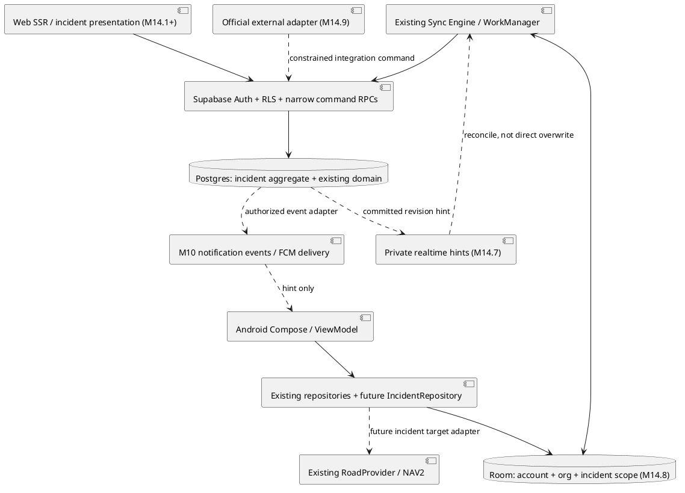
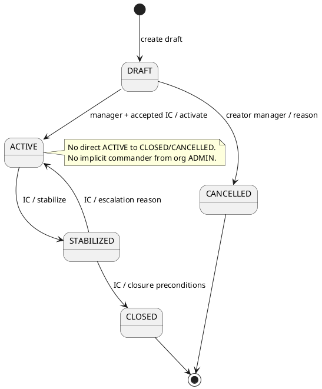
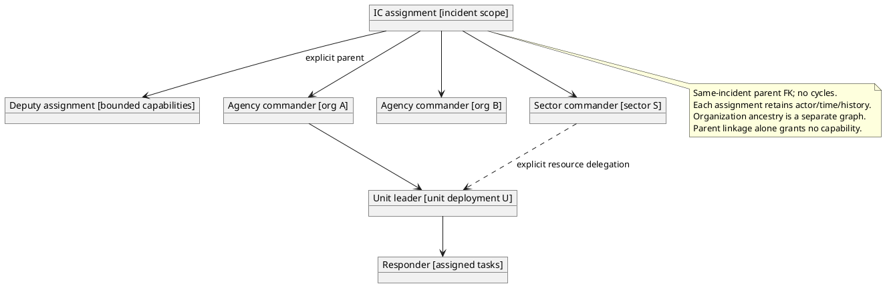
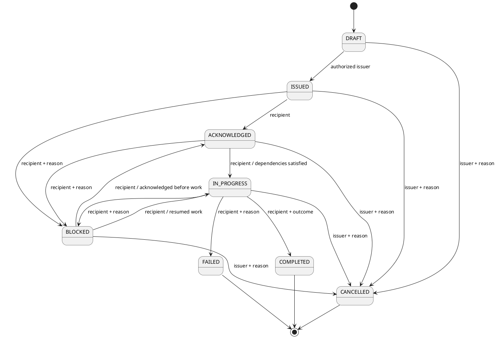
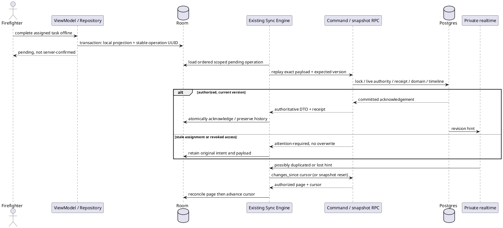
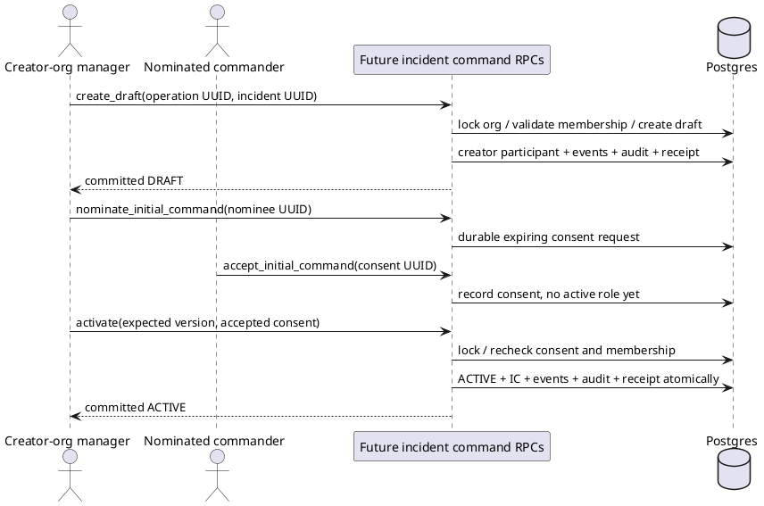
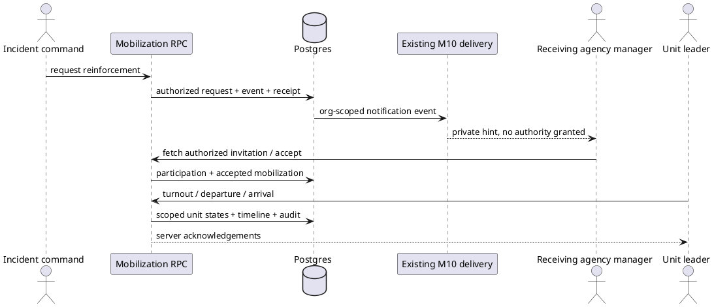
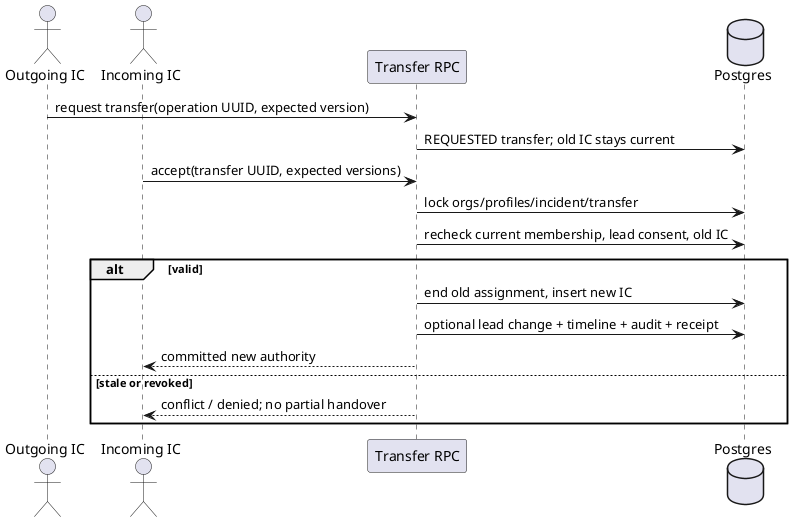
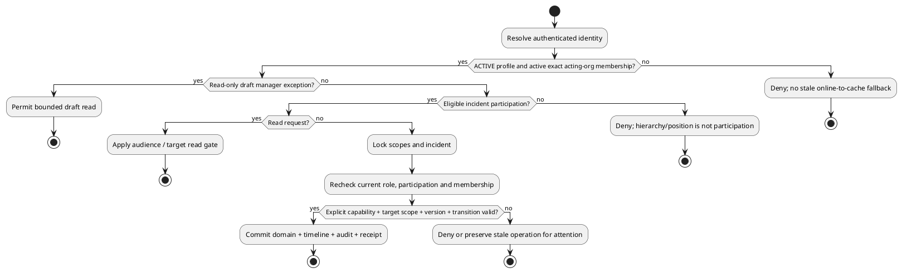

# SPEC-M14-Incident-Operations

## Background

This is the authoritative Incident Operations / Rescue Command extension to
[SPEC.md](SPEC.md). It defines M14.0 through M14.10. Existing hydrant,
inspection, planning, authentication and organization behavior remains governed
by SPEC.md. This extension introduces an incident aggregate; it does not turn an
inspection plan into an emergency, an inspection team into a vehicle, or an
organization administrator into an incident commander.

Baseline: merged PR #52, main `ba000f82c7ed577cacff126cdda62d776d7227ad`.
Firefighting is the first use case. Organizations representing Civil Protection,
EMS, Police, municipalities and specialist rescue services use the same identity,
participation and command contracts. No agency-specific integration is assumed.

### Architecture inspected and reuse decision

| Existing source / concept | Decision |
| --- | --- |
| `20260917120000_geography_organizations_profiles.sql`; `20260917140000_memberships_roles_rls.sql` | Reuse `profiles`, `organizations`, `user_organizations`, account states and exact-organization roles. An active membership means a present membership row, ACTIVE profile and active organization; there is no invented membership-active column. |
| `20261001140000_web_admin_organization_foundation.sql` | Reuse configurable organization types, relationships and positions. Inherited hierarchy remains READ-only for its existing modules. It does not imply incident participation or command. |
| `20260918090000_review_bootstrap_audit.sql`; hydrant authorization migration | Reuse `audit_log`, `private.write_audit`, `private.audit_immutable`, organization security locks and live profile/membership checks. Do not introduce another audit subsystem. |
| Hydrant schema, inspection teams/plans and M7 execution | Reference existing hydrant UUIDs. Inspection rosters/plans retain their current semantics. Incident resource assignments are a different domain relationship. Reuse version, operation UUID and locked RPC patterns, with durable incident receipts as described below. |
| `20261005140000_notifications.sql`, existing FCM Edge delivery | Reuse events, category preferences, device registration and delivery leases/logs. Add incident event/recipient adapters later, not a second notification transport. |
| `supabase/functions/plan-routes/provider.ts` | Reuse `RoadProvider` (`snap`, `matrix`, `route`), OSRM primary and current fallback/configuration. Incident business targets later adapt to this boundary; no routing infrastructure change now. |
| Android `RegistryDatabase`, Room repositories, sync engine/worker, authorization and MapLibre/NAV1/NAV2 | Keep Compose → ViewModel → Repository → Room. Extend the existing durable worker/queue architecture in M14.8; no direct UI Supabase access, second worker or navigation engine. |
| Web `lib/admin/context.ts`, `lib/auth/load.ts`, Supabase SSR | Reuse server-verified session and per-request context. Existing Web ADMIN/MANAGER entry is not incident-command authority. A later incident entry can admit an authorized firefighter without widening administrative access. |
| Existing migrations / DATABASE.md | No usable unit/vehicle/resource or incident aggregate exists. No PostGIS dependency is introduced. |

### What M14.0 actually implements

One additive migration creates five public tables: `incident_types`, `incidents`,
`incident_participants`, `incident_role_assignments`, `incident_timeline`; two
caller-bound private authorization helpers; two read RPCs; constraints, indexes,
SELECT RLS and history deletion guards. Only `OTHER` reference configuration is
seeded. No operational records, UI, mutation RPCs, publication, jobs or storage
buckets are created. Android, Web, M10, routing and existing schemas are unchanged.

The foundation intentionally grants **no INSERT/UPDATE/DELETE/TRUNCATE to anon,
authenticated or service_role** on these tables. Database owner maintenance is
not an operational API. M14.1 must implement the locked, audited commands below
before clients can create incidents. Database shape constraints are present now;
multi-row lifecycle/command invariants and mutation emissions belong to those
commands, not to an unimplemented generic write endpoint.

## Requirements

### Must have

- One stable UUID per incident, separate display reference, explicit participants
  and live scoped command authority. No duplicate users, organizations or hydrants.
- Strict state transitions; explicit ownership/control boundaries; one current IC;
  same-incident foreign keys; no silent authority derived from positions/hierarchy.
- Server-acknowledged, versioned, idempotent commands; append-only operational
  evidence and existing audit records. No silent overwrite of offline intent.
- Room field reads and durable local field operations; reconnect reconciliation;
  notification/realtime messages never grant access or imply command completion.
- Private attachments; bounded location sharing; current authorization checked at
  server commit; no service credentials in Android/browser.
- Language-neutral codes with default/Slovenian/German presentation. UTC timestamps,
  explicit WGS84 coordinate order, validated bounded geometry.
- Incremental M14.1–M14.10 delivery with no production migration applied by M14.0.

### Should have

- Consistent incident context snapshots, keyset timeline pages, typed command
  targets and incident revision cursors; concise operator acknowledgements.
- Agency, sector and unit delegation; explicit command handover; cached route and
  map presentation using existing infrastructure; reportable historical relations.

### Could have

- Official CAD/112 adapters, optional narrowly scoped GPS sharing and organization
  policy configuration once contracts, authority and retention are agreed.
- Configurable closure warnings and number formatting without changing UUID identity.

### Will not have in M14.0

Full incident screens/workflows, sectors/resources/tasks/dispatch tables, realtime
subscriptions, incident Room cache, external adapters, location telemetry, reports
or fake data. QR, route capacity 100→200, Oracle/OSRM changes, offline-map hosting,
SMTP completion, FIX pack, M11–M13 and unrelated planning idempotency cleanup remain
on hold. The known M9 `web_import_confirm` ambiguity (`target` → `wir.target`) is
explicitly deferred to M14.1; its migration is not changed here.

## Method

### 1. Aggregate, identity, time and state

An incident is a real-world operation shared by explicit participating
organizations. `created_organization_id` records provenance;
`lead_organization_id` records current coordination responsibility;
`actor_organization_id` identifies the caller's selected authority for a command.
An incident is not owned by whichever organization is currently selected in UI.
Physical resources keep their owning organization during cross-agency deployment.

UUID is canonical for all references and retry identities. `reference_number` is
nullable until allocated by M14.1, unique within creator organization and
`reference_year`. Year is derived at creation in the validated incident timezone
and never changes after number allocation, including a lead transfer. Formatting
is configurable; no final prefix or sequential business format is prescribed.
A private per-organization/year allocator in M14.1 may consume numbers with gaps.
Numbers never authorize access and external IDs never become internal PKs.

All persisted operational times use `timestamptz`. Server timestamps order commits;
client `occurred_at` describes an observation and never decides ordering or authority.
`timezone` is an IANA name validated against `pg_timezone_names` by future create/
edit RPCs. The foundation bounds the string only. Default `Europe/Ljubljana` is
presentation context, not a naive timestamp format.

Severity measures assessed consequences (`UNKNOWN`, `MINOR`, `MAJOR`, `CRITICAL`).
Incident priority measures response urgency (`LOW`, `NORMAL`, `HIGH`, `CRITICAL`).
Dispatch and task priority use their own fields with those urgency codes and do
not mutate incident severity or lifecycle.

| From → to | Authority and invariant | Evidence |
| --- | --- | --- |
| DRAFT → ACTIVE | Exact creator-org MANAGER/ADMIN, online; lead ACTIVE participation exists; nominated IC has explicitly accepted and has current lead-org membership; valid type/title/location or explicit unknown-location reason | INCIDENT_ACTIVATED + audit |
| DRAFT → CANCELLED | Exact creator-org MANAGER/ADMIN; non-empty reason; no deployment | INCIDENT_CANCELLED + audit |
| ACTIVE → STABILIZED | Current IC, online | INCIDENT_STABILIZED + audit |
| STABILIZED → ACTIVE | Current IC, online; escalation reason; clear current stabilized_at while retaining earlier event | INCIDENT_REACTIVATED + audit |
| STABILIZED → CLOSED | Current IC, online; closure contract in §13 | INCIDENT_CLOSED + audit/report |

All other transitions are denied, including ACTIVE→CLOSED, ACTIVE→CANCELLED and
reopening a terminal incident. Mistaken active incidents are stabilized and closed
with an explanation; cancellation must not erase deployed activity. M14.10 can
introduce an explicit exceptional workflow only by updating this contract.
`declared_at` is first activation, `started_at` is known real-world start,
`stabilized_at` describes the current stabilization, and closure/cancellation times
are exclusive. History retains every earlier transition.

### 2. Implemented data dictionary

Status codes below are bounded text CHECK constraints, not PostgreSQL enums.
Incident categories use a reference table, matching existing configuration practice.
Every FK uses `ON DELETE RESTRICT`. UUID defaults are convenient for trusted callers;
mobile commands must supply their pre-generated IDs. Counters are BIGINT; transport
clients must preserve full precision rather than treating them as JavaScript floats.

#### `public.incident_types` — IMPLEMENTED_IN_M14_0

Needed now: incident categorization cannot reference hydrant types or hard-code an
agency-specific enum. PK `id uuid`; unique `code text` matching uppercase stable
codes, maximum64 characters. `names jsonb` requires nonempty `sl` and `de` strings,
object ≤4096bytes; additional language keys are allowed. `active boolean`,
`created_at/updated_at timestamptz`. UUID `14000000-0000-4000-8000-000000000001`
identifies `OTHER`. FIRE_STRUCTURE, FIRE_VEHICLE, WILDFIRE, TECHNICAL_RESCUE,
TRAFFIC_ACCIDENT, HAZMAT, FLOOD, SEARCH_RESCUE and MEDICAL_SUPPORT are examples for
later authorized configuration, not seeds. Types referenced by history are
deactivated rather than removed. ACTIVE accounts may SELECT including inactive
historical types. No client writes; future configuration is controlled maintenance.

#### `public.incidents` — IMPLEMENTED_IN_M14_0

Needed now: neither hydrants nor inspection plans model an emergency aggregate.

| Columns | Contract |
| --- | --- |
| `id uuid` | PK |
| `reference_number text?`, `reference_year smallint` | Trimmed nonempty1–80 if present; year2000–9999; immutable numbering scope |
| `title text`, `summary text` | Trimmed title1–200; summary ≤10000, default empty |
| `incident_type_id uuid` | FK incident_types; future writes require active type, old inactive reference remains readable |
| `severity`, `priority`, `status text` | Codes/state machine §1; default UNKNOWN/NORMAL/DRAFT |
| `created_organization_id`, `lead_organization_id uuid` | Existing organizations FKs, both required |
| `created_by uuid` | Existing profiles FK, required and server-derived |
| `latitude`, `longitude double precision?` | Both absent or both finite and within [-90,90]/[-180,180]; separate named fields |
| `address text?` | ≤1000 characters |
| `started_at`, `declared_at`, `stabilized_at`, `closed_at`, `cancelled_at timestamptz?` | Status/time consistency CHECK and chronological checks |
| `timezone text` | Bounded1–100; future RPC validates IANA name |
| `metadata jsonb` | Object ≤8192bytes, extensions only, never authority/identity/state |
| `created_at`, `updated_at timestamptz` | Server-maintained by future commands |
| `version bigint` | Core row optimistic version, starts1 |
| `revision bigint` | Aggregate change cursor, starts0, increases for every accepted domain transaction |
| `timeline_sequence bigint` | Last committed event sequence, starts0 |

Core fields are mutable through planned commands until terminal state. Creator,
UUID and number scope never mutate. Current-state rows persist long-term; timeline
and audit preserve changes. External identity is a future separate mapping, not an
unvalidated metadata identifier. Read scope is §4; no client mutations.

#### `public.incident_participants` — IMPLEMENTED_IN_M14_0

Needed now: organization hierarchy is not consent to incident participation.
PK `id uuid`; FKs `incident_id`, `organization_id`; `agency_role text`
LEAD/SUPPORT/LIAISON describes the agency relationship, **not personal command**.
`status text` REQUESTED/ACTIVE/RELEASED/DECLINED/CANCELLED;
`source text` CREATOR/INVITATION/REQUEST/EXTERNAL. Required `requested_by` profiles
FK and `requested_at`; nullable `accepted_by/accepted_at`, `ended_by/ended_at`,
`end_reason` (nonempty≤2000). `updated_at`, positive `version`.

REQUESTED has no accept/end values; ACTIVE requires accept values and no end;
RELEASED requires both accept and end; DECLINED/CANCELLED have end/reason and no
accept. Time ordering is checked. Rejoin creates a new episode UUID. Terminal
episodes are never reset to ACTIVE. At most one REQUESTED/ACTIVE episode per
incident/org and at most one ACTIVE LEAD. Composite unique keys support scoped
assignment/timeline FKs. Participant history is long-lived, no deletion. Full
rows are incident-reader-visible; invitation preview for a not-yet-participating
org is a separate minimal future RPC, not broader SELECT RLS.

#### `public.incident_role_assignments` — IMPLEMENTED_IN_M14_0

Needed now: organization role/position cannot encode temporary incident authority.
PK `id uuid`; `incident_id` FK; `(participation_id,incident_id,organization_id)`
composite FK to one participant episode; `user_id` and `assigned_by` profile FKs.
`role` currently INCIDENT_COMMANDER/DEPUTY_COMMANDER/AGENCY_COMMANDER/OPERATOR/
RESPONDER. `parent_assignment_id` optional same-incident self FK; no self-parent;
IC has no parent. `status` ACTIVE/ENDED/REVOKED; `valid_from`, optional
`valid_until > valid_from`; `ended_by/ended_at/end_reason` required for terminal
states and absent while ACTIVE; `created_at/updated_at`, positive `version`.

One ACTIVE IC per incident, one ACTIVE agency commander per incident/org and one
ACTIVE exact incident/org/user/role assignment. Time expiry removes effective
authority immediately but does not free the unique slot until an explicit end
command records history. Parent chains confer no inherited capabilities.
M14.2 adds `sector_id` and M14.4 `unit_assignment_id` with same-incident FKs before
allowing SECTOR_COMMANDER and UNIT_LEADER. No dangling future scope UUIDs now.
Assignment identity, user, role, participant, parent and valid_from are immutable
once issued; corrections end the episode and create another. Future commands
enforce this and acyclic active parents under aggregate lock. This foundation has
no writable API that could bypass these planned invariants. History is long-lived.

#### `public.incident_timeline` — IMPLEMENTED_IN_M14_0

Needed now: `audit_log` is security evidence and notifications are delivery hints;
neither is an incident's ordered operational history. PK `id uuid`; `incident_id`
FK; positive `sequence` and `revision bigint`; `operation_id uuid` and positive
`event_ordinal smallint`; stable `event_code text` regex uppercase≤80;
`actor_user_id/actor_organization_id` existing profile/org FKs;
optional `participation_id` OR `assignment_id` same-incident FK (at most one);
`recorded_at` server clock, optional `occurred_at` observation time;
`data jsonb` object≤16384bytes with event-specific DTO (§9).

Unique `(incident_id,sequence)` and `(incident_id,operation_id,event_ordinal)`.
Incident-wide events leave subject FKs null. Future subject types add explicit
FK columns with exclusivity checks; never authorization through arbitrary JSON.
UPDATE/DELETE/TRUNCATE are rejected by existing immutable-history trigger.
Incident readers may see all foundation events; sensitive later communications
are separately scoped, never hidden payloads in this shared stream. Long-lived.

#### Index and uniqueness inventory (including implicit indexes)

| Table | Index / constraint | Access path / invariant |
| --- | --- | --- |
| incident_types | PK(id), UNIQUE(code) | UUID joins and stable configuration code |
| incidents | PK(id) | Aggregate lock/read |
| incidents | `incidents_reference_unique(created_organization_id,reference_year,reference_number)` WHERE number nonnull | Display reference uniqueness, not identity |
| incidents | `incidents_creator_list_idx(created_organization_id,updated_at DESC,id)` | Creator draft/list keyset |
| incidents | `incidents_lead_list_idx(lead_organization_id,status,updated_at DESC,id)` | Lead dashboard/future lifecycle filtering |
| incident_participants | PK(id); UNIQUE(id,incident_id,organization_id); UNIQUE(id,incident_id) | Scoped assignment/event FKs |
| incident_participants | `incident_participants_live_unique(incident_id,organization_id)` WHERE REQUESTED/ACTIVE | One open participation episode |
| incident_participants | `incident_participants_lead_unique(incident_id)` WHERE ACTIVE/LEAD | One lead episode |
| incident_participants | `incident_participants_org_idx(organization_id,status,incident_id)` | Caller-org incident list / live read gate |
| incident_role_assignments | PK(id); UNIQUE(id,incident_id) | Same-incident parent/event FKs |
| incident_role_assignments | `incident_roles_commander_unique(incident_id)` WHERE ACTIVE IC | One current IC slot |
| incident_role_assignments | `incident_roles_agency_unique(incident_id,organization_id)` WHERE ACTIVE agency commander | One commander per agency |
| incident_role_assignments | `incident_roles_live_unique(incident_id,organization_id,user_id,role)` WHERE ACTIVE | No duplicate role episodes |
| incident_role_assignments | `incident_roles_user_idx(user_id,incident_id)` WHERE ACTIVE | Current caller capabilities |
| incident_role_assignments | `incident_roles_participation_idx(participation_id,incident_id,organization_id)` | Release/revoke episode lookup |
| incident_role_assignments | `incident_roles_parent_idx(parent_assignment_id,incident_id)` WHERE parent nonnull | Command children lookup |
| incident_timeline | PK(id); UNIQUE(incident_id,sequence); UNIQUE(incident_id,operation_id,event_ordinal) | Stable identity, keyset timeline, no duplicate event per operation |

No speculative geometry/JSONB/status-only indexes are added. Timeline has no
timestamp pagination index because server sequence is the ordering authority.

### 3. Participation and command authority

Participation lifecycle: REQUESTED→ACTIVE/DECLINED/CANCELLED;
ACTIVE→RELEASED. Exact receiving-org MANAGER/ADMIN accepts/declines an invitation;
the IC/deputy invites, but cannot conscript another organization's membership.
Creator participation is activated in the draft-creation transaction by its
MANAGER/ADMIN. Requests by an organization still require IC acceptance plus its
own manager's consent. A released org loses active operational access immediately;
after closure, its current active members may read shared incident history.

Lead transfer and command transfer are distinct explicit commands. The IC may
belong only to the ACTIVE lead organization. Lead transfer therefore atomically
changes lead participant roles, incident lead org and IC episode to a consenting
qualified member of the new lead organization. A command transfer within the same
lead org ends the old IC episode and inserts the accepted successor. Neither
creator provenance nor hierarchy rank changes during either transfer.

M14.2 handover uses a durable `incident_command_transfers` request with from/to
assignment/user/org, expiry, requester, recipient acceptance and reason. Outgoing
IC remains authoritative until acceptance commits. Acceptance rechecks current
memberships, participation, old IC and incident/transfer versions under locks.
It ends the old assignment before inserting the new one in the same transaction;
unique indexes prevent overlapping current ownership. A timed-out/rejected request
changes no authority. No automatic successor, offline handover or ADMIN override.
If the last commander loses authority, operations fail closed; an exceptional
recovery policy requires a separately approved later contract, not a hidden bypass.

Role capabilities:

- IC: incident-wide operational command, lifecycle, participants, roles and handover.
- Deputy: existing edit-summary/invitation capabilities remain unchanged. M14.5A
  adds no blanket task authority. Cannot transfer command or close by implication.
- Agency commander: own agency's deployed resources and scoped tasking. Cannot
  command another agency merely because both participate.
- Sector commander: only expressly delegated sector/resources/tasks. Sector
  geography is not an authorization source; membership in its command scope is.
- Unit leader: own incident unit/crew statuses and assigned task acknowledgements/
  outcomes. Cannot transfer command or assign unrelated units.
- Operator: read plus explicitly scoped operational note/map actions later; never
  an all-powerful dispatcher role by name alone.
- Responder: read and own assigned task acknowledgement/completion; no command grant.

All require current ACTIVE profile, active exact organization membership,
ACTIVE participation and effective non-revoked assignment. Roles carry scope,
not a caller-selectable capabilities JSON. Multi-role users select one acting
organization per command; privileges from unrelated organizations cannot be mixed.

### 4. Authorization matrix and RLS

Legend: **ALLOW** means role capability exists, still subject to the universal
live checks, incident state, target scope and expected version. **CONDITIONAL**
means the additional condition below is required. **DENY** means this role alone
never grants it. Tables split the same matrix for readability.

| Principal | Read incident | Activate | Edit summary | Invite org | Accept participation | Assign incident role | Create sector | Assign unit |
| --- | --- | --- | --- | --- | --- | --- | --- | --- |
| Ordinary org FIREFIGHTER | CONDITIONAL P | DENY | DENY | DENY | DENY | DENY | DENY | DENY |
| Ordinary org MANAGER | CONDITIONAL P/D | CONDITIONAL D | CONDITIONAL D | DENY | CONDITIONAL O | DENY | DENY | DENY |
| Ordinary org ADMIN | CONDITIONAL P/D | CONDITIONAL D | CONDITIONAL D | DENY | CONDITIONAL O | DENY | DENY | DENY |
| Incident responder | ALLOW | DENY | DENY | DENY | DENY | DENY | DENY | DENY |
| Unit leader | ALLOW | DENY | DENY | DENY | DENY | DENY | DENY | DENY |
| Sector commander | ALLOW | DENY | DENY | DENY | DENY | DENY | DENY | CONDITIONAL S |
| Agency commander | ALLOW | DENY | DENY | DENY | DENY | CONDITIONAL A | DENY | CONDITIONAL A |
| Incident commander | ALLOW | DENY | ALLOW | ALLOW | DENY | ALLOW | ALLOW | ALLOW |
| Non-participant inherited reader | DENY | DENY | DENY | DENY | DENY | DENY | DENY | DENY |
| Unrelated organization member | DENY | DENY | DENY | DENY | DENY | DENY | DENY | DENY |

| Principal | Issue task | Ack task | Complete task | Transfer command | Close | Edit map object | Read timeline |
| --- | --- | --- | --- | --- | --- | --- | --- |
| Ordinary org FIREFIGHTER | DENY | DENY | DENY | DENY | DENY | DENY | CONDITIONAL P |
| Ordinary org MANAGER | DENY | DENY | DENY | DENY | DENY | DENY | CONDITIONAL P/D |
| Ordinary org ADMIN | DENY | DENY | DENY | DENY | DENY | DENY | CONDITIONAL P/D |
| Incident responder | DENY | CONDITIONAL T | CONDITIONAL T | DENY | DENY | DENY | ALLOW |
| Unit leader | CONDITIONAL U | CONDITIONAL T/U | CONDITIONAL T/U | DENY | DENY | CONDITIONAL U | ALLOW |
| Sector commander | CONDITIONAL S | CONDITIONAL T | CONDITIONAL T | DENY | DENY | CONDITIONAL S | ALLOW |
| Agency commander | CONDITIONAL A | CONDITIONAL T | CONDITIONAL T | DENY | DENY | CONDITIONAL A | ALLOW |
| Incident commander | ALLOW | CONDITIONAL T | CONDITIONAL T | ALLOW | ALLOW | ALLOW | ALLOW |
| Non-participant inherited reader | DENY | DENY | DENY | DENY | DENY | DENY | DENY |
| Unrelated organization member | DENY | DENY | DENY | DENY | DENY | DENY | DENY |

P: exact active member of ACTIVE participant org, or RELEASED participant after
terminal incident. D: creator-org MANAGER/ADMIN in DRAFT; activation also requires
accepted named IC. O: accepting only their own organization's invitation, with
minimal invite preview. A: own agency resources/RESPONDER or UNIT_LEADER delegation,
not IC/deputy/other agency roles. S: explicitly delegated sector resources; cannot
pull resources from other sectors. U: own unit/crew; task issue means subordinate
tasks to own crew, not self-escalation or another unit. T: personally assigned task
or designated active leader of its assigned unit. Authority to issue a task does
not let its issuer fabricate a recipient's acknowledgement/completion.

No operational assignment is automatically given to the draft creator/activator.
Activation is a bounded organizational bootstrap action, with accepted IC named
explicitly. An IC is never permitted activation solely by holding another
incident's IC role. Current foundation capabilities cover only five online core
actions; future scope-specific capabilities must be added with their target FKs.

| Implemented table | SELECT | INSERT / UPDATE / DELETE |
| --- | --- | --- |
| incident_types | ACTIVE account, including inactive historical types | None for clients/service_role |
| incidents | DRAFT: exact active creator-org MANAGER/ADMIN. Other states: exact active member of ACTIVE participant, or RELEASED participant in terminal state | None; future narrow RPC only |
| incident_participants | Same incident read gate; participation never inferred from org hierarchy | None; future narrow RPC only |
| incident_role_assignments | Same incident read gate; public operational identity only | None; future narrow RPC only |
| incident_timeline | Same gate; shared operational events only | None; future trusted append only; no update/delete even through ordinary maintenance |

`private.can_read_incident` and `private.has_incident_capability` are SECURITY
DEFINER, empty search_path, caller-bound to auth.uid(), and expose boolean answers
only. Existing membership helpers plus explicit org.active checks avoid recursive
RLS. All other new functions are SECURITY INVOKER and retain RLS. Every new
function revokes default PUBLIC execution before authenticated grants. There are
no dynamic SQL/filter arguments. Service-role use is not an authorization strategy.

An inherited Web reader can still read the existing authorized organization data;
that does not grant incident access. Incident participation does not widen hydrant,
profile, photo or inspection RLS either. Cross-agency display uses authorized
minimal incident DTOs, not unrestricted joins to another org's private records.

### 5. Future domain dictionary (specified, not created)

The following entries are **contracts**, not empty M14.0 tables. Unless stated
otherwise: UUID PK; existing profile actor FKs; incident-scoped composite FKs
`(id,incident_id)`; `created_at/updated_at timestamptz`, positive `version bigint`
and `changed_revision bigint`; RESTRICT deletion; SELECT through authorized
incident/target scope; no direct client DML; writes through §8 commands; soft
terminal state and long-lived history. Indexes listed are the intended minimum,
to be added with the owning milestone, not now. Global inventory tables use
organization scope and the existing role helpers instead.

| Entity / delivery | Columns and invariants | Indexes, authorization and retention |
| --- | --- | --- |
| `private.incident_operation_receipts` M14.1 | PK operation_id; actor_user_id, acting_org_id, incident_id, command_code, canonical_request jsonb≤64KiB, response jsonb≤128KiB, committed_at; same UUID with different actor/scope/request rejected; immutable success receipt | UNIQUE PK globally; (incident_id,committed_at); no client table access; command replay rechecks read authority; long-lived |
| `private.incident_number_counters` M14.1 | PK(organization_id,reference_year), next_value bigint>0; FK org; allocation under row lock, format separate | PK only; private command access; not business identity |
| `incident_command_transfers` M14.2 | incident_id, from_assignment_id, to_user_id, to_org_id, kind COMMAND/LEAD_AND_COMMAND, reason1–2000, status REQUESTED/ACCEPTED/DECLINED/CANCELLED/EXPIRED, requested_by/at, expires_at, decided_by/at, operation_id; no mutation of accepted history | Unique live REQUESTED per incident; unique operation_id; (to_user_id,status,incident_id); read commander/recipient, redacted decision event shared; long-lived |
| `incident_sectors` M14.3 | incident_id, code≤64, name≤200, optional validated Polygon geometry, active, created_by/updated_by; sector command is role assignment, not a duplicated commander column | UNIQUE(incident_id,code); (incident_id,active); shared read, IC/deputy create, scoped commander edits; deactivate, long-lived |
| `incident_map_objects` M14.3 | incident_id, kind COMMAND_POST/STAGING/HAZARD/WATER_SOURCE/ACCESS_POINT/PERIMETER/NOTE, label≤200, description≤4000, geometry, optional sector_id, created_by/updated_by, active; water-source marker is not a copy of a hydrant | (incident_id,active,changed_revision); optimistic updates, capability/scope gates; deactivate and retain historical versions in events |
| `incident_hydrant_links` M14.3 | id,incident_id,hydrant_id FK existing hydrants, purpose WATER_SUPPLY/REFERENCE, created_by, active; optional bounded report-only snapshot captured at use/closure | UNIQUE(incident_id,hydrant_id,purpose); incident read plus existing hydrant read for live data; linking requires source read; no duplicated registry |
| `operational_vehicles` M14.4 | organization_id, callsign≤80, name≤200, category_code, registration?≤80, active, availability AVAILABLE/UNAVAILABLE, seats integer≥0, water_litres integer≥0, bounded typed capability map; no maintenance accounting | UNIQUE(org,callsign) for active rows; (org,active); owning org role writes; participating users get minimal deployment DTO, not private registration; long-lived |
| `operational_units` M14.4 | organization_id, callsign≤80, name≤200, unit_kind VEHICLE_CREW/RESCUE_TEAM/DRONE_TEAM/MEDICAL_TEAM/OTHER, optional vehicle_id same org FK, active, capability codes; a vehicle may be absent | UNIQUE(org,callsign) active; (org,active); exact-org inventory control; no incident authority implicit |
| `incident_units` M14.4 | incident_id, participation_id/org scoped FK, unit_id same-org FK, optional sector_id, status per §6, assigned_by/at, released_by/at, commander_assignment_id, assignment episode times | UNIQUE(unit_id) WHERE not RELEASED/UNAVAILABLE prevents double deployment; (incident_id,status), (participation_id); IC/agency scope writes; release/new episode, long-lived |
| `incident_crew_members` M14.4 | incident_id, unit_assignment_id, user_id FK profile, membership_org_id, crew_role LEADER/DRIVER/RESPONDER/SPECIALIST, joined_at,left_at,status ACTIVE/LEFT, added_by; active exact org membership checked at commit | UNIQUE(incident_id,user_id) active; (unit_assignment_id,status); UNIT_LEADER authority is a separate explicit role assignment; member histories long-lived |
| `operational_resources` M14.4 | organization_id, name, resource_type_code, unit_of_measure_code, total_quantity numeric≥0, active; one row denotes a countable stock or individually identified item (quantity1), not a person | (org,active,type); exact-org inventory write; no fleet/warehouse ERP |
| `incident_resource_allocations` M14.4 | incident_id, resource_id, participant_id, quantity>0, optional unit_assignment_id, status RESERVED/DEPLOYED/RETURNED/CONSUMED/CANCELLED, allocated_by/at, ended_at | (incident_id,status),(resource_id,status); lock stock row and sum live allocations ≤available; owner unchanged; long-lived |
| `operational_action_definitions` M14.5A | SYSTEM or exact-org stable code; current immutable version; future availability | Bounded catalogue RPC; exact-org administration; no direct DML |
| `operational_action_definition_versions` M14.5A | Immutable labels, native behavior, recipient/target classes and declarative parameters | Tasks retain the exact historical version |
| `incident_tasks` M14.5A | incident_id, exact action version, issued_by/org, priority, title≤200,notes≤4000, canonical target + historical geometry/label, parameters≤8KiB, OPEN/CLOSED/CANCELLED + outcome, version,changed_revision | Incident/status/time page; no direct DML; immutable intent |
| `incident_task_assignments` M14.5A | One explicit unit OR crew-member episode per recipient; independent status, actor/time/reasons, version,changed_revision | Same-incident composite FKs, unique task/recipient; no physical deletes; terminal immutable |
| `incident_task_dependencies` FUTURE (not M14.5A) | PK(task_id,depends_on_task_id), incident_id, created_by/at, active; both same incident, no self/cycle; deactivate instead of delete | Reverse(depends_on_task_id,active); task issuer authority; DAG checked under incident lock; retain history |
| `incident_mobilizations` M14.6 | incident_id, recipient_org_id, requested_by, priority, reason, status REQUESTED/ACCEPTED/DECLINED/CANCELLED/FULFILLED, requested_at,responded_by/at, response_reason | (recipient_org_id,status,requested_at); current-org managers see minimal request even before joining; acceptance creates participation through same contract; long-lived |
| `incident_turnout_responses` M14.6 | mobilization_id, incident_id, user_id OR unit_id exactly one, status AVAILABLE/UNAVAILABLE/EN_ROUTE/ARRIVED/RELEASED, response_at, departure_at,arrival_at,release_at; optional ETA is declared, not invented routing time | Unique(mobilization,target) via partial user/unit indexes; (incident_id,status); own response or authorized unit leader, long-lived |
| `incident_messages` M14.7 | incident_id, sender_user_id/acting_org_id, audience INCIDENT/ORGANIZATION/UNIT, audience_org_id OR unit_assignment_id matching audience, body≤4000, sent_at, supersedes_id?; append-only corrections | (incident_id,sent_at,id), audience lookup; recipient SELECT RLS, no broadcast of private text to timeline; operational communication, not social chat |
| `incident_attachments` M14.7 | incident_id, uploader_user_id/org, task_id OR message_id OR map_object_id optional max1, storage_path unique, content_hash, mime_type,size_bytes,captured_at, status PENDING/AVAILABLE/ATTENTION/RETRACTED; no public URLs | (incident_id,status), unique storage_path; target audience gate + private Storage; immutable bytes after registration, explicit retraction; policy retention |
| `incident_changes` M14.7 | PK(incident_id,revision,ordinal), entity_kind + typed subject FK, operation UPSERT/REVOKE, audience scope, entity_version, recorded_at; identifiers only, authorized current DTO fetched in snapshot | Keyset PK; private writer, scoped change reader; retention30days then mandatory full snapshot; not an audit replacement |
| `incident_current_positions` M14.8 | incident_id, unit_assignment_id PK with incident, sharing_user_id, device_registration_id reference existing device, lat/lon,accuracy_m≥0,observed_at,received_at,expires_at,sequence; source opt-in foreground sharing | (incident_id,expires_at); scoped incident unit read; latest only, TTL15min, no permanent trail; no M14.0 implementation |
| `private.incident_external_links` M14.9 | id, provider_code, external_event_id, incident_id, last_provider_revision?,last_payload_hash, last_received_at; UNIQUE(provider_code,external_event_id) | Incident lookup; adapter-only, long-lived minimal mapping; never primary identity |
| `private.incident_external_receipts` M14.9 | id,provider_code,external_message_id,payload_hash,provider_revision?,received_at,processed_at,outcome,incident_id?, encrypted_raw_payload_ref? | UNIQUE(provider_code,external_message_id); provider/event revision uniqueness where supported; private only; raw payload≤72h, minimal dedupe receipt long-lived |
| `incident_closures` M14.10 | id,incident_id,final_commander_assignment_id,closed_by/at,reason,outcome,final_revision,snapshot_schema_version,snapshot_private_path,content_hash; immutable sealed snapshot | UNIQUE(incident_id); incident historical read; close command only; long-lived; later amendments append linked records, never replace seal |

Reference codes for unit categories, capabilities, resource measures and task types
must become small validated configuration tables when introduced, not arbitrary
authorization JSON. They are not seeded or added now. Vehicle registration,
medical details, personal contact data and credentials do not belong in shared COP
DTOs. Original identity tables remain authoritative; historical snapshots are
clearly labeled and cannot grant access.

### 6. Units, tasks and mobilization state machines

Organization is the legal/administrative participant. Unit is a deployable
operational entity; vehicle is an owned asset; crew is a temporary set of existing
people assigned to a unit; person is an existing profile; resource is a countable
asset/stock. A saved inspection team can supply a roster suggestion with explicit
current-membership checks, but is never automatically a deployed crew. Deploying
a unit does not transfer vehicle/resource ownership to the lead organization.

| Unit state transition | Command rule |
| --- | --- |
| AVAILABLE→REQUESTED | Dispatch request; no implied arrival |
| REQUESTED→DISPATCHED or UNAVAILABLE | Owning agency accepts/declines; reason on unavailable |
| DISPATCHED→EN_ROUTE→ON_SCENE | Unit leader records actual departure/arrival |
| ON_SCENE→ASSIGNED→ON_SCENE | Authorized scoped tasking / release from task |
| ON_SCENE/ASSIGNED→RETURNING→RELEASED | Explicit release/return; unfinished tasks addressed |
| Any nonterminal→UNAVAILABLE | Explicit inability/safety reason; task impact retained for command attention |

Unavailable/released deployment episodes never silently reactivate. A fresh
assignment episode requires fresh authority and readiness. Short-circuit arrival
after a missed device report is an explicit server command recording omitted
steps as unknown, not invented timestamps. Per-person turnout does not change an
entire unit's state automatically. Crew membership dates remain independent of
vehicle availability and permanent org membership.

M14.5A implements one immutable task intent with one or more recipient assignment
episodes; it supersedes the original single-assignee task proposal. An order is a
server-authoritative issue/transition/cancel command, not a second task database.
Tactical doctrine lives in versioned configuration, not task-type engine enums.

| Assignment transition | Actor / data |
| --- | --- |
| ISSUED → ACKNOWLEDGED → IN_PROGRESS → COMPLETED | Effective leader of the recipient unit, or matching eligible crew member |
| ISSUED → IN_PROGRESS | Same executor, only if that immutable action version does not require acknowledgement |
| ISSUED / ACKNOWLEDGED → UNABLE | Same executor, nonempty reason |
| IN_PROGRESS → BLOCKED | Same executor, nonempty reason |
| BLOCKED → IN_PROGRESS / UNABLE | Same executor; UNABLE needs a reason |
| Any nonterminal → CANCELLED | Current issuer authority for that recipient |

COMPLETED, UNABLE and CANCELLED are terminal and cannot reopen. Each assignment
progresses independently. The parent stays OPEN until all assignments are
terminal, then CLOSED/SUCCESS (all completed), CLOSED/PARTIAL (some completed),
or CLOSED/FAILED (none completed). Explicit whole-task cancellation yields
CANCELLED, cancels only nonterminal children and retains terminal siblings.
No reassignment, dependencies or draft persistence are implemented in M14.5A.

Authority follows current explicit command relationships: IC across the incident;
agency commander within own participating organization; sector commander only
units explicitly assigned to that sector and their crew; unit leader only active
crew in their own unit. Deputy gets no new blanket authority. Recipient execution
is separate: commanders cannot impersonate an executor. Descriptive crew LEADER
does not substitute for an effective UNIT_LEADER assignment.

RTS selection/targeting is deferred to M14.5B. The current form can issue one task
with up to 100 independently identified child assignments; selection alone never
issues a command. COMMAND INTENT != EXECUTION PLAN != TELEMETRY.

Mobilization (M14.6): IC/deputy requests an organization or already available unit;
receiving org accepts/declines; acceptance establishes participation through the
same participant contract. Organization/unit/member turnout responses remain
distinct. Unit dispatch, departure, arrival and release use the same unit state
machine. Requests for reinforcement are mobilizations linked to the incident,
not cloned incidents. FCM alerts are hints; an actual response must commit through
an authorized command and produce timeline evidence. No response is inferred from
push delivery, notification opening or GPS proximity.

### 7. COP, geometry, routing and location sharing

The future COP read model combines incident point, sectors/zones, operational
markers, existing authorized hydrants/water sources, units, command posts,
staging areas, tasks, routes and timeline. Selected organization layers use their
existing authorization. All entities retain UUID identity and source provenance;
MapLibre sources/layers are projections, not stores of authority.

Transport geometry is GeoJSON **Geometry**, WGS84 `[longitude, latitude]`.
Named API fields remain `latitude`/`longitude`. M14.3 stores validated bounded
JSONB geometry without adding PostGIS now. Allowed types: Point for positions;
LineString for perimeters/paths where the object kind permits; Polygon for sectors
and zones. No arbitrary FeatureCollection/properties blob, CRS override, Z/M
coordinates or GeometryCollection. Maximum geometry64KiB and2000 coordinate pairs;
LineString≥2 vertices; Polygon rings≥4, closed, non-self-intersecting; latitude
[-90,90], longitude[-180,180], all finite. Dateline-crossing geometry is rejected
with a clear unsupported-geometry error initially. Validation is performed by the
server and DB helper before writes, not only Compose/MapLibre. Bounds columns can
be derived later if a real spatial query requires indexes. PostGIS would require
an explicit future dependency decision, not a hidden installation.

Map edits use expected entity version, actor and updated_at. A stale edit returns
both authoritative state and unchanged local intent for explicit resolution.
No CRDT, last-write-wins or automatic merging of operational boundaries. Sector
geometry does not change command delegation automatically.

Hydrant markers remain at their canonical original coordinates. Road snapping is
only a routing input/output; it never rewrites a hydrant. The existing `RoadProvider`
returns snapped points, road matrix and route geometry; incident target adapters
later pass incident/task/unit context without reusing plan ownership logic.
Reuse current OSRM primary, fallback behavior, navigation step/camera/bearing and
reroute logic. No new provider, keys in clients, Oracle setting or capacity change.
The current100 capacity remains. A provider failure never becomes fabricated
straight-line travel distance/time. Offline clients show cached route geometry
with age and provider; new route calculation needs connectivity. NAV2 consumes
an explicit selected target and may not silently retask a unit.

Location sharing is **future opt-in**, scoped to an ACTIVE incident unit, preferably
one designated leader device. Existing device registration is reused; sharing
identity is not an unrestricted device token. Defaults: foreground updates at most
every10seconds and when moved≥10m, accuracy/observed time included, stale display
after2minutes, expire latest position after15minutes. No background permission or
tracking implied by joining an incident. No GPS trail is stored initially. If a
later operational policy needs short trails, maximum24h, explicit notice/consent
and separately reviewed retention are required. Stop on opt-out, release, account/
org switch or authorization loss. Reject another unit's position, future timestamps
>2minutes and out-of-order device sequence updates. Reconnection sends latest
position, not a replayed location history. Positions are not audit events, push
payloads or permanent employee-performance records. Sharing start/stop can be
audited without retaining coordinates in audit. No telemetry is implemented now.

### 8. Canonical API / RPC dictionary

#### Common command envelope — PLANNED_M14_1

All future mutations take `operation_id UUID`, `incident_id UUID` (preallocated
also for create), `acting_organization_id UUID`, `expected_version BIGINT` for
the target row, and a typed bounded payload. Actor comes only from `auth.uid()`.
Creation uses expected_version0. Commands affecting several entities take named
expected versions for each safety-sensitive entity. No generic table name,
SQL filter or client-provided event/authority payload is accepted.

Success DTO: `{contract_version:1, operation_id, incident_id, entity_id,
entity_version, incident_revision, timeline_from, timeline_to, state}` with an
explicit typed state projection. Domain failure codes: NOT_AUTHORIZED (also hidden
not-found), STALE_VERSION, INVALID_TRANSITION, INVALID_SCOPE, OPERATION_REUSED,
PRECONDITION_FAILED. Transport failure remains retryable; authorization/stale
failure remains attention-needed with original local data intact. Acknowledgement
means transaction committed, not merely queued HTTP/FCM delivery.

Durable receipt key is global operation UUID, scoped in the receipt to actor,
incident and acting org. A retry must match canonical typed request exactly,
including explicit null/default normalization. Different payload/actor/scope
raises OPERATION_REUSED. Save immutable receipt in the same transaction as domain,
timeline and audit. A lost-response retry may replay its original successful DTO
after current read authorization is rechecked, even though its expected version
is now old; it must not reapply the mutation. Replays cause no new timeline/audit/
notifications. Do not copy a last-operation-only shortcut from planning: later
operations must not destroy earlier retry receipts.

| Contract / availability | Input → result | Authorization; idempotency/concurrency; evidence |
| --- | --- | --- |
| `incident_context` IMPLEMENTED_IN_M14_0 | `(p_incident_id uuid,p_acting_organization_id uuid)` → explicit core DTO with contract_version1, UUID/reference,title/summary/type,severity/priority/status,lead/creator org,point/address/timezone,version/revision/timeline_sequence,updated_at,acting org,sorted capabilities | Current incident read + exact active acting org that is eligible for that incident; absent/denied→null. Read-only; one SQL statement snapshot; no receipt/event/audit. Does not pretend to be full future operational snapshot. |
| `incident_timeline_page` IMPLEMENTED_IN_M14_0 | `(p_incident_id uuid,p_acting_organization_id uuid,p_after_sequence bigint=0,p_limit int=100)` → contract_version1, incident_id, events ascending sequence, high_watermark | Same context gate; null for denied/absent. Limit clamps1–200; negative/null cursor→0. Next cursor is last returned sequence, never high_watermark until all pages consumed. SQL snapshot, no write/evidence. |
| `private.can_read_incident` IMPLEMENTED_IN_M14_0 | `(p_incident_id uuid)` → boolean | Caller-bound profile/exact active membership/participation; no target-user parameter; draft manager exception; read helper only, no event. |
| `private.has_incident_capability` IMPLEMENTED_IN_M14_0 | `(p_incident_id uuid,p_acting_organization_id uuid,p_capability text)` → boolean | Current effective explicit role in ACTIVE/STABILIZED incident; IC five core capabilities, deputy EDIT_SUMMARY/INVITE_ORGANIZATION; unknown capability false. Advisory read; future writes must recheck under locks. |
| `incident_create_draft` PLANNED_M14_1 | Envelope + type,title,summary,point/address or unknown_location_reason,timezone,priority,severity,started_at → core DTO | Exact active creator-org MANAGER/ADMIN; client incident/participant UUIDs; version0; validate type/timezone; atomically create creator ACTIVE LEAD participation and receipt. INCIDENT_CREATED/PARTICIPANT_JOINED + audit. No implicit IC. |
| `incident_update_summary` PLANNED_M14_1 | Envelope + allowed core fields → core DTO | Draft creator-org manager or live IC/deputy; expected core version; no lifecycle/lead/identity changes; INCIDENT_DETAILS_UPDATED + audit. |
| `incident_nominate_initial_command` PLANNED_M14_1 | Envelope + consent UUID, nominee user, expires_at → consent DTO | Exact creator-org manager, DRAFT, nominee current lead-org member; durable nomination only, no role grant; COMMAND_NOMINATED + audit. |
| `incident_accept_initial_command` PLANNED_M14_1 | Envelope + nominated user=self, proposed assignment UUID → acceptance DTO | Nominated active lead-org member explicitly consents; draft manager's nomination bound to incident version; server records expiring consent, no active role until activation. COMMAND_ACCEPTED + audit. Consent storage added with M14.1 write model. |
| `incident_activate` PLANNED_M14_1 | Envelope + accepted commander nomination ID/version → core DTO | Creator-org manager, DRAFT only; recheck nominee consent/membership, lead participant; insert IC atomically, set declared_at; INCIDENT_ACTIVATED/COMMAND_ASSIGNED + audit. |
| `incident_change_lifecycle` PLANNED_M14_1 | Envelope + next_status,reason → core DTO | §1 transitions only; draft cancel manager, stabilize/reactivate IC; CLOSED delegated to close contract; expected version; transition event + audit. |
| `incident_request_participation` PLANNED_M14_1 | Envelope + participant UUID, recipient org,agency_role SUPPORT/LIAISON,reason → invitation DTO | IC/deputy; target active org; dedupe receipt plus one live episode; PARTICIPANT_REQUESTED + audit. External/self-request entry adapters cannot bypass receiving consent. |
| `incident_invitation_context` PLANNED_M14_1 | participant UUID, acting org → minimal title,type,requester org,request time,status | Receiving-org exact manager; no full incident/map/timeline exposure; read-only, no events. |
| `incident_accept_participation` PLANNED_M14_1 | Envelope + participant ID/expected version, decision ACCEPT/DECLINE,reason → participant DTO | Exact receiving-org manager, REQUESTED only; live account/org; receipt; PARTICIPANT_JOINED/DECLINED + audit. |
| `incident_release_participation` PLANNED_M14_2 | Envelope + participant ID/version,reason → participant DTO | IC and release acknowledgement by agency commander/own manager; lead must first transfer; unresolved units/tasks require explicit handling; end roles atomically; PARTICIPANT_RELEASED + audit. |
| `incident_assign_role` PLANNED_M14_2 | Envelope + assignment UUID,participant,user,role,parent,scope,valid_until → assignment DTO | IC; agency commander only own-agency responder/unit-leader grants, never IC; active membership/parent, no cycles/self-escalation; IC change uses transfer only. COMMAND_ASSIGNED + audit. |
| `incident_end_role` PLANNED_M14_2 | Envelope + assignment/version,reason → ended DTO | Granting command scope; IC termination requires accepted successor or closure; preserve episode; COMMAND_ENDED/REVOKED + audit. |
| `incident_request_command_transfer` PLANNED_M14_2 | Envelope + transfer UUID,to_user,to_org,kind,reason,expires_at → transfer DTO | Current IC; target current lead org unless LEAD_AND_COMMAND; recipient org must ACTIVE; one pending transfer; COMMAND_TRANSFER_REQUESTED + audit. |
| `incident_accept_command_transfer` PLANNED_M14_2 | Envelope + transfer/version,current IC version,new assignment UUID → command context | Named recipient, current exact membership; target-org manager consent additionally for lead transfer; recheck old authority/version, atomically end/start and change lead if needed; COMMAND_TRANSFERRED/[LEAD_ORGANIZATION_CHANGED] + audit. |
| `incident_add_operational_note` PLANNED_M14_7 | Envelope + note text≤4000,occurred_at → event DTO | Active scoped responder/operator/commander, no arbitrary event code/actor; bounded text; receipt. OPERATIONAL_NOTE_ADDED + audit without duplicating sensitive body. This is the only user-facing append-like action. |
| `private.append_incident_event` PLANNED_M14_1 | Validated typed code/subject/data from trusted command, operation UUID/ordinal → event UUID/sequence | Not client-callable. Lock incident, increment sequence in same transaction; caller function derives actor; event catalog whitelist. Receipt owns idempotency; unique event tuple is secondary protection. |
| `incident_create_sector` PLANNED_M14_3 | Envelope + sector UUID,code,name,geometry? → sector DTO | IC/deputy, geometry checks, version0; SECTOR_CREATED + audit. |
| `incident_put_map_object` PLANNED_M14_3 | Envelope + object UUID,kind,label,geometry,sector? → object DTO | IC/deputy or scoped commander/operator capability; expected version; MAP_OBJECT_CREATED/UPDATED + audit. |
| `incident_assign_unit` PLANNED_M14_4 | Envelope + assignment UUID,participation,unit,sector?,accepted availability/version → unit deployment DTO | IC with owning agency consent, or own agency commander; sector commander only delegates already offered units in own scope; lock unit/incident; UNIT_ASSIGNED + audit. |
| `incident_transition_unit` PLANNED_M14_4 | Envelope + unit assignment/version,next_status,reason/observed_at → unit DTO | Unit leader own unit for movement/status, command authority for task allocation/release; §6; UNIT_STATUS_CHANGED + audit. |
| `incident_issue_task` IMPLEMENTED_M14_5A | Envelope + stable task/action-version/assignment UUIDs, target, typed parameters → receipt | Current explicit authority and eligibility for every recipient, current action version, expected incident core version; TASK_ISSUED + audit. |
| `incident_transition_task_assignment` IMPLEMENTED_M14_5A | Envelope + assignment UUID, expected assignment version, next state/reason → receipt | Recipient execution or issuer cancellation scope; aggregate recomputed atomically; TASK_ASSIGNMENT_* / TASK_CLOSED + audit. |
| `incident_cancel_task` IMPLEMENTED_M14_5A | Envelope + task UUID, expected task version → receipt | Current issuer scope over all nonterminal recipients; terminal evidence preserved; TASK_CANCELLED + audit. |
| `incident_reassign_task` FUTURE (not M14.5A) | Envelope + task/version,new assignee,reason → task DTO | Issuer command scope; unfinished only, online; retain previous assignee/result evidence; TASK_REASSIGNED + audit. |
| `incident_request_mobilization` PLANNED_M14_6 | Envelope + request UUID,target org/unit,priority,reason → request DTO | IC/deputy/current scoped agency commander, exact target checks; MOBILIZATION_REQUESTED + audit and M10 hint. |
| `incident_respond_turnout` PLANNED_M14_6 | Envelope + request/version,person=self OR led unit,state,observed_at → response DTO | Own current membership or unit leader; receipt; TURNOUT_RESPONDED/UNIT_STATUS_CHANGED + audit. |
| `incident_operational_snapshot` PLANNED_M14_7 | incident,acting org,page token? → core,participants,command,units/tasks/map authorized DTO pages + pinned revision R and sequence S | Current incident and audience gates; consistent snapshot manifest with expiring token; no dozens of independent unordered UI queries; read-only. |
| `incident_changes_since` PLANNED_M14_7 | incident,acting org,cursor(revision,ordinal),limit≤200 → authorized change descriptors,next cursor,high_watermark,reset_required | Current authority on every page; history gap/expired manifest→full snapshot; no events/audit. |
| `incident_close` PLANNED_M14_10 | Envelope + reason,outcome,final summary,unit/task disposition references → closure DTO | Current IC, STABILIZED, no pending command transfer, §13; row locks/version; immutable closure snapshot, INCIDENT_CLOSED + audit. |

The M14.1 consent record must be durable (`private.incident_command_consents`:
PK id, incident FK, nominee profile/org, nominated_by, requested_at,expires_at,
accepted_at?,consumed_at?, expected_incident_version, operation UUID UNIQUE).
Only named nominee/creator-org manager see its narrow DTO; one unconsumed consent
per nominee/incident, consumed atomically by activation, long-lived evidence.
No role is granted by an unaccepted nomination. This small write-workflow table is
deliberately not created by M14.0.

APIs evolve additively under `contract_version:1`; unsupported command codes fail
explicitly. Unknown timeline codes render a neutral localized event and keep raw
DTO for later refresh, never cause a client crash or grant capability. Breaking
changes require a negotiated new contract, not silently changed table-row JSON.

### 9. Timeline, audit and operational event catalog

Timeline is shared operational evidence; audit is the existing security/change
record with before/after data and organization actor; notification event is a
delivery trigger; message is scoped communication. They have separate purpose and
retention. Do not use FCM delivery time as event order, audit rows as the COP feed,
or chat text as task status. Task/unit/participant histories derive from typed
entities and explicit transitions, never parsing notes.

Every accepted domain command locks the incident and advances `revision` once.
It allocates one or more contiguous `timeline_sequence` values while holding that
lock, inserts timeline and audit, and stores the receipt in the same transaction.
Rollback rolls back counters/events as well. Concurrent transactions cannot
publish an event with a lower committed sequence after a higher one. Sequences
are incident-local, not global. Client time can be displayed separately.
`version` changes only on the affected entity; core version need not increase for
every task note. A transaction's multiple events share its revision and have
distinct positive event ordinals.

Audit uses `private.write_audit(actor_org, auth.uid(), event_code, entity_kind,
entity_uuid, before, after)`. Cross-agency commands record the actor org and typed
affected org IDs; no broad cross-org audit SELECT policy is added. The shared
timeline carries safe operational evidence to participants. Credentials, medical
details, raw external payloads and routine precise GPS fixes are excluded.

| Stable event codes | Required typed data / subject; emitter milestone |
| --- | --- |
| INCIDENT_CREATED, INCIDENT_DETAILS_UPDATED | Incident subject; changed field names, core version; M14.1 |
| INCIDENT_ACTIVATED, INCIDENT_STABILIZED, INCIDENT_REACTIVATED, INCIDENT_CANCELLED, INCIDENT_CLOSED | from/to status, reason when required, server effective time; M14.1 / closure M14.10 |
| PARTICIPANT_REQUESTED, PARTICIPANT_JOINED, PARTICIPANT_DECLINED, PARTICIPANT_RELEASED, PARTICIPANT_CANCELLED | participation FK, org ID, previous/next status, reason; M14.1–2 |
| COMMAND_NOMINATED, COMMAND_ACCEPTED, COMMAND_ASSIGNED, COMMAND_ENDED, COMMAND_REVOKED | assignment FK once created, role, org, effective interval; consent event references typed consent DTO without authority; M14.1–2 |
| COMMAND_TRANSFER_REQUESTED, COMMAND_TRANSFER_DECLINED, COMMAND_TRANSFER_EXPIRED, COMMAND_TRANSFERRED, LEAD_ORGANIZATION_CHANGED | transfer FK added with M14.2, old/new assignment/org IDs, reason, effective time |
| SECTOR_CREATED, SECTOR_UPDATED, SECTOR_DEACTIVATED | future sector FK, version, changed fields; M14.3 |
| MAP_OBJECT_CREATED, MAP_OBJECT_UPDATED, MAP_OBJECT_DEACTIVATED, HYDRANT_LINKED | future typed subject FK, version and minimal kind/label; M14.3 |
| UNIT_ASSIGNED, UNIT_STATUS_CHANGED, UNIT_RELEASED, CREW_JOINED, CREW_LEFT, RESOURCE_ALLOCATED, RESOURCE_RETURNED | future unit/crew/resource FK, from/to status or quantity, observed/server time; M14.4 |
| TASK_ISSUED, TASK_CANCELLED, TASK_CLOSED; TASK_ASSIGNMENT_ACKNOWLEDGED/STARTED/BLOCKED/COMPLETED/UNABLE/CANCELLED | Typed task or assignment FK, old/new state, actor/time, reason and aggregate outcome; implemented M14.5A |
| MOBILIZATION_REQUESTED, MOBILIZATION_ACCEPTED, MOBILIZATION_DECLINED, TURNOUT_RESPONDED | future mobilization/response FK, org/unit/person, response code; M14.6 |
| OPERATIONAL_NOTE_ADDED, ATTACHMENT_REGISTERED | authorized text or attachment FK; no public URL; M14.7 |
| EXTERNAL_EVENT_LINKED | internal incident and provider code, no raw payload; M14.9 |
| INCIDENT_REPORT_SEALED, INCIDENT_REPORT_AMENDED | closure/report ID, revision/hash, reason; M14.10 |

Codes are never translated in storage. SI/DE/default strings render codes/data.
No emissions are implemented in M14.0. Its regex permits future stable codes;
trusted append helper later whitelists code-specific typed payloads. Event data
is bounded evidence, not a substitute for foreign keys or role checks.

### 10. Concurrency, realtime and offline synchronization

#### Locking and commit-time authorization

Future commands acquire existing organization security locks for involved actor,
target and resource-owner organizations in sorted UUID order, then relevant profile
rows in sorted order, then the incident row `FOR UPDATE`, then subject rows in
stable order. They re-read ACTIVE profile, active organization, exact membership,
participation, role validity and expected versions under those locks. This
coordinates with existing membership revocation; callers cannot authorize from a
stale screen. Multi-org commands retry serialization failures using the same
operation UUID, never by dropping expected-version checks. Unique receipt insert
conflicts resolve to exact replay or OPERATION_REUSED. No network/provider call is
performed while holding these database locks.

Authorization reads are advisory, not a substitute for this transaction. M14.0
intentionally cannot commit operations until M14.1 supplies these guards.
Concurrent task completion/reassignment or command transfer/revocation must yield
one committed result and one explicit conflict, never two owners or lost outcomes.

#### Realtime and snapshots — M14.7

Supabase authenticated private incident channels carry only
`{incident_id,revision,timeline_sequence}` hints. Membership in a channel is
authorized from the same current read helper. No public channel or globally
subscribed table with client-side filtering. Channel revocation/expiry must
disconnect clients; REST/RPC authorization is still checked on every fetch/write.
Realtime may duplicate, reorder or lose hints; server tables and Room are truth.

Initial entry requests an authorized snapshot manifest pinned to revision R and
sequence S. Large units/tasks/map collections are keyset-paginated against that
same pinned snapshot (server materialized private manifest, TTL5minutes, caller+
incident+acting-org bound). An expired manifest restarts; the client cannot mix
pages from unrelated revisions. M14.7 chooses a bounded manifest storage
implementation and adds its cleanup then; no speculative cache tables now.
After all pages commit in Room, request changes after R and timeline after S.

`incident_changes` pages are ordered by `(revision,ordinal)`, never OFFSET. Each
descriptor names an authorized entity/version or scope removal; fetch DTOs under
current permissions and atomically reconcile to Room. Realtime hints only schedule
this same path. If cursor is older than the30day change retention or scope changed,
return reset_required, obtain a fresh snapshot, preserve local pending/attention
records. Snapshot absence is not permission to erase unsynced rows. Duplicate DTOs
use UUID/version. After a whole page is durably applied, advance cursor. Refresh
cannot resurrect stale authority or overwrite a local pending operation.

#### Android field operation classification — M14.8

Reuse existing Room account isolation, WorkManager scheduling, serial queue
processing, retry/acknowledgement history and attention handling. Incident cache
keys include `(account_id,incident_id,acting_organization_id,entity_id)` where
scope matters. Extend existing queue payload kinds and explicit incident scope;
do not overload organization ID as incident ID, clone a second queue engine or
change the meaning of existing hydrant operations. Queue ordering uses durable
insertion order plus parent dependency: parent must be acknowledged before child.
Separate incident commands need not block unrelated registry work, but a scoped
conflict must stop dependent incident operations. Never automatically rebase
authority-changing commands onto a newer version.

| Classification | Operations | Offline behavior and server reconciliation |
| --- | --- | --- |
| SAFE_OFFLINE_QUEUE | Own task ACK/start/block/complete/fail; own unit departure/arrival/status observations; own turnout availability; task notes/photos/evidence | Persist original payload, operation/entity UUID, actor/account/org/incident, base version, observed time and dependencies atomically with local projection. Display pending, never delivered/accepted. Server rechecks current assignment/auth/state; stale or revoked→attention with preserved intent. |
| ONLINE_PREFERRED | Low-risk operational notes, proposed non-command map annotations | May retain local proposal and queue with expected version; not authoritative COP until ack. No boundary/command edits under this category. |
| ONLINE_REQUIRED | Incident create/activate/lifecycle/close, participation acceptance/release, role grants/revocation, lead/command transfer, unit ownership/allocation, task issue/reassignment, sector/boundary edits, resource reservations | No optimistic authority/ownership change. UI explains online verification required; a local unsent proposal may be retained but is not an actionable command. |

Existing M3 organizational30day cached authorization continues unchanged for the
registry, including7day/1day warnings. It does **not** create an incident command
lease. Incident field cache additionally requires a server-verified read/own-task
snapshot no older than24hours (default safety boundary for M14.8, explicit future
policy change required). Effective expiry is the earlier of org snapshot expiry,
incident lease expiry and session invalidation. Keystore-protected account/org
authorization storage is reused. Offline role snapshots only explain cached
assignments; they never authorize ONLINE_REQUIRED commands. No offline password
authentication. Warn at2hours remaining for the incident cache lease separately
from unchanged org warnings. After expiry, hide protected incident data and require
online verification; retain encrypted/account-isolated queued evidence for retry.

Successful online denial immediately invalidates incident scope/lease and hides
its cache; it must never fall back to an earlier success. Sign-out/account/org
switch cancels subscriptions/requests, clears visible state and location callbacks;
generation tokens reject late results. Pending work remains tied to its original
account and cannot upload as the next account. Cache eviction cannot delete
pending attachments/operations. Assignment changes on another device may invalidate
offline completion; preserve it for human review, never silently mark success or
apply it to a different task.

### 11. Notifications, communications and attachments

M10 remains the only notification system. Future incident categories (for example
INCIDENT_MOBILIZATION, INCIDENT_COMMAND, INCIDENT_TASK) extend existing
`private.notification_categories`; existing preferences and user-editable policy
remain in force. Do not invent a second device/token table, FCM worker or delivery
log. Map an incident event to one existing org-scoped notification event per
eligible recipient organization using a deterministic source key containing
incident,event UUID and recipient org. Recipient resolver must check ACTIVE
account/exact membership plus current incident role/task/unit/audience; extend the
existing resolver in the delivering milestone, do not use inherited org readers.

Recheck recipient eligibility at delivery, and again on tap/fetch. Payload contains
only hint/event ID and a generic localized lock-screen message, never full incident
location, victim names, private notes, precise GPS or storage URL. Notification
opening navigates only after normal authorization; it neither grants access nor
acknowledges a task. Persist transactionally generated notification event, deliver
after commit using M10 leases/retries. FCM success is not operational acceptance.
No M10 schema or delivery implementation is modified in M14.0.

Operational messages are short scoped notes (incident/agency/unit), with append-only
corrections. Critical orders use task commands and explicit acknowledgement, not
chat alone. Message read receipts are optional later and cannot substitute for
task acknowledgement. Private audience content never appears in incident-wide
timeline or push. Reports must respect the same audience boundaries.

Incident attachments reuse private Storage, authenticated loading/cache, staged
files and stable UUID/object paths from the existing photo approach. They need
their own incident/target FK metadata later, not an overloaded inspection_id or
public bucket. Parent incident/task/message must commit before registration/upload;
retry IDs/files remain stable; pending files are never cleaned as unowned. Allowed
M14.7 file types initially prepared JPEG/WebP images≤10MiB and PDF≤20MiB, server
validated MIME/content length; no executable/HTML uploads. Storage path includes
incident/attachment UUID, never external URL authority. Short-lived signed fetch
is issued only after current target authorization; cached files are partitioned by
account and audience, hidden after revocation. No new storage policies/bucket now.

### 12. External trigger / CAD / 112 contract

M14.9 introduces provider adapters only when an official supported interface and
credentials/data agreement exist. No invented112endpoint, scraping or undocumented
live integration. Edge adapter verifies provider signature/mTLS or documented
credential, timestamp/replay window and payload size (default256KiB) before parsing.
Secrets stay in server secret storage and never enter logs/database payloads.

Canonical normalized input: provider_code, external_event_id, external_message_id,
provider_revision or immutable payload hash, occurred_at, type mapping, title,
location/address, bounded details and configured receiving organization. The
adapter resolves existing org/type mappings; external strings cannot create an
ADMIN, member or command role. It calls the same incident command service with a
registered integration principal, validated org allowlist and audit attribution;
no unconstrained service-role table inserts. M14.9 must explicitly add this narrow
principal contract without relaxing auth.uid()-bound human APIs.

Unique provider/event mapping picks one internal UUID. Unique provider/message
receipt makes repeated deliveries idempotent; a new revision updates only permitted
source fields under expected version, never overwrites operator command state.
Same message ID with different payload is quarantined; out-of-order versions are
recorded but not applied. Without provider revisions, payload hashes dedupe and
ambiguous updates require operator review. External cancel is a proposal, never
automatic cancellation/closure of an active incident. Minimal dedupe IDs/hashes are
long-lived; encrypted raw payload, if necessary for diagnosis, expires within72h.
No raw personal dispatch narrative in shared logs or permanent metadata.

### 13. Closure, reporting and retention

M14.1 may stabilize an incident but cannot close it until M14.10 provides the
closure command. Strict closure prerequisites: STABILIZED; current IC; no unresolved
command/lead transfer; every unfinished task explicitly completed/failed/cancelled
or referenced in an accepted outstanding-work disposition; every deployed unit
released or explicitly acknowledged as transferred to a separately authorized
continuing operation; final commander, actor, reason, outcome and server time.
Disposition must not fabricate recipient completion. Closure atomically seals
the final revision and lifecycle; private report generation can occur after commit
against that immutable snapshot. Failure to render a PDF cannot undo closure or
silently change its data.

Configurable warnings: missing optional narrative, photo, agency response or final
resource count. They require recorded acknowledgement but are not arbitrary hard
blocks. Identity, authorization, immutable outcomes, unresolved handover and
explicit disposition are strict, not configurable away. Future field validation
may refine optional warnings through an explicit spec change.

Report snapshot includes incident core/type labels, participant episodes, command
intervals, sectors/map references, unit/crew/resource assignments, task outcomes,
arrival/departure/release times, used hydrant UUID and historical code/location
when necessary, attachment references, ordered timeline and closure actor/reason.
Snapshots never become live registry sources or authorization grants. Later PDF,
CSV/XLSX use existing export patterns with current historical read permissions;
no M14.0 exporter. Amendments append reason/author/time and a linked new report
version; original completed records remain immutable.

| Data category | Retention / deletion contract |
| --- | --- |
| Incident core, participant/command history, timeline, task outcomes, receipt IDs, closures | Long-lived, no automatic TTL or ordinary hard delete; legal retention period configured by operator before production, not asserted as a statutory rule here |
| Audit | Existing policy unchanged; security evidence not replaced by incident timeline |
| Unit/vehicle/resource catalog | Deactivate; ownership/history FKs retained |
| Shared operational attachments/messages | Follow incident policy and audience; explicit redaction/retention procedure, no silent deletion of pending evidence |
| Incremental change descriptors | 30days; expired cursor forces full authorized snapshot |
| Realtime hints/manifests | Transient; snapshot token TTL5min; no permanent duplicate event store |
| GPS | Latest unit point expires15min; no trail by default; approved future trail≤24h |
| Integration raw payload | ≤72h encrypted diagnostic retention; long-lived minimal dedupe mapping |
| Notification delivery records | Existing M10 retention/policy; no extension to permanent incident history |

All new foundational tables reject DELETE/TRUNCATE, timeline also rejects UPDATE.
Future lawful maintenance is a separately authorized database procedure with
retention/legal-hold review, anonymization where appropriate and independent audit;
it is not an ordinary ADMIN UI action and must not cascade-delete history. No
automatic purge job is added. Mutable episode state always produces immutable
timeline/audit evidence through future commands.

### 14. PlantUML architecture diagrams

These diagrams are source contracts, not rendered/validated artifacts in M14.0.
Dashed/future components do not imply an implementation already exists.

#### 14.1 System / component architecture



#### 14.2 Core ER / future references

```plantuml
@startuml
hide methods
entity organizations { * id : UUID }
entity profiles { * id : UUID }
entity user_organizations {
  * user_id : UUID
  * organization_id : UUID
  role : text
}
entity incident_types { * id : UUID }
entity incidents {
  * id : UUID
  created_organization_id : UUID
  lead_organization_id : UUID
  version : bigint
  revision : bigint
  timeline_sequence : bigint
}
entity incident_participants {
  * id : UUID
  incident_id : UUID
  organization_id : UUID
  status : text
}
entity incident_role_assignments {
  * id : UUID
  participation_id : UUID
  user_id : UUID
  parent_assignment_id : UUID
  role : text
}
entity incident_timeline {
  * id : UUID
  incident_id : UUID
  sequence : bigint
  operation_id : UUID
}
entity "incident_tasks (M14.5)" as tasks
entity "incident_units (M14.4)" as units
organizations ||--o{ user_organizations
profiles ||--o{ user_organizations
organizations ||--o{ incidents : creator / lead
incident_types ||--o{ incidents
incidents ||--o{ incident_participants
organizations ||--o{ incident_participants
incident_participants ||--o{ incident_role_assignments
profiles ||--o{ incident_role_assignments
incident_role_assignments |o--o{ incident_role_assignments : parent, same incident
incidents ||--o{ incident_timeline
incidents ||..o{ units
incidents ||..o{ tasks
@enduml
```

#### 14.3 Incident lifecycle



#### 14.4 Command assignment hierarchy



#### 14.5 Task lifecycle



#### 14.6 Realtime / offline reconciliation



#### 14.7 Create / activate



#### 14.8 Future mobilization



#### 14.9 Explicit command transfer



#### 14.10 Authorization decision flow



## Implementation

### M14.1 implementation decisions

M14.1 implements the first Web Incident Core on merged M14.0. This subsection
resolves implementation details and the explicitly requested limited closure
extension; all other domain/security boundaries above remain authoritative.

- New forward migrations: `20261006120000_incident_core.sql` and
  `20261006121000_import_target_qualification.sql`. Neither changes the historical
  M14.0/M9 migration or applies itself to a live database.
- Web routes: `/[locale]/incidents`, `/new`, and `/[incident UUID]`, with an explicit
  `org` acting-context query. The incident UUID is the same across participating
  organizations. ACTIVE users enter from Account; Admin navigation also links
  here without granting inherited-org access. No Android/Room change.
- `incident_entry` returns current exact active organizations and create flags,
  active localized types, up to50 invitation previews and50 nomination previews.
  These bounded inbox previews deliberately do not grant full draft read access.
  A non-manager nominee can accept consent in their inbox. Process/refresh to see
  further inbox items; this is not a national membership directory.
- `incident_list` uses25-row `(created_at,id)` descending keyset pages, scoped by
  acting organization and optional lifecycle state. `incidents_created_cursor_idx`
  supports this new path. `incident_context` retains its signature and adds typed
  detail, participant history, current/latest commander, nomination and action
  flags. `incident_candidates` returns at most30 active organizations (identity
  only) or active lead-org member names/IDs, with bounded substring search.
  Candidate/inbox reads never widen profile/organization table RLS.
- `incident_timeline_page` retains ascending sequence keysets and the same bounds,
  and adds actor/organization labels to avoid per-row directory reads. All BIGINT
  versions/revisions/cursors are now decimal strings in Web-facing DTOs to avoid
  JavaScript precision loss; consumers pass those strings back as BIGINT inputs.
- The server generates incident UUID once. The immutable receipt maps the caller's
  operation UUID to that identity, so lost-response retries return the same UUID.
  Reference format is internal `INC-YYYY-NNNNNN` (minimum six digits), unique in
  creator-organization/year scope. The UI always shows organization context; the
  same reference may exist in another organization. It is not an official112number.
  A private locked counter allocates the number; year uses Europe/Ljubljana, which
  is also the initial report timezone. No caller-controlled numbering/creator/time.
- Manual primary coordinates may be absent together only with a nonempty
  `unknown_location_reason` (≤1000characters). This validated extension is stored
  under that one metadata key; clients cannot submit arbitrary metadata. Activation
  rechecks point or reason. No geocoding, browser tracking or map editor.
- `private.incident_operation_receipts` is needed because existing Web hydrant
  audit receipts identify a hydrant operation and planning uses different domain
  payloads. Incident receipts have a global operation UUID PK, actor/org/incident,
  fixed command code, bounded canonical JSONB request and immutable result/time.
  JSONB equality is the payload identity (no lossy hash-only comparison). Retry
  checks current account/exact active acting membership and original actor/request.
  It returns only the caller's minimal acknowledgement, never an old detail
  snapshot; this also permits consent/invitation acknowledgement replay where full
  draft read is intentionally unavailable. No operational authority is replayed.
- A private fixed-command dispatcher centralizes the transaction. Public wrappers
  are narrow: `incident_create_draft`, `incident_update_summary`,
  `incident_nominate_initial_command`, `incident_accept_initial_command`,
  `incident_request_participation`, `incident_accept_participation`,
  `incident_decline_participation`, `incident_consent_release`,
  `incident_release_participation`, `incident_activate`, `incident_stabilize`,
  `incident_reactivate`, `incident_close`, `incident_cancel`.
  Each accepts `(p_operation UUID,p_acting_organization_id UUID,p_incident_id UUID,
  p_expected_version BIGINT,p_payload JSONB)`. Create uses null incident and version0;
  other calls use the core version. Payload keys are explicitly allowlisted. These
  wrappers implement the corresponding planned contracts in §8; no public generic
  status/role/table mutation is exposed.
- `private.incident_acting_member` and `private.incident_draft_manager` augment,
  not replace, M14.0 read/capability helpers. The existing `private.lock_organization`
  and profile-row locks serialize membership/account changes. Operation advisory
  lock precedes sorted org/profile locks and incident FOR UPDATE. Every successful
  M14.1 command advances core version (except creation starts1); affected
  participant/assignment versions advance too. Aggregate revision advances once;
  each event consumes one incident sequence. This conservative core version also
  rejects stale concurrent child/lifecycle actions before broader per-entity
  concurrency is needed in later milestones.
- `private.append_incident_event` accepts only this milestone's event catalog,
  derives actor from auth.uid(), coordinates counter update and appends typed
  evidence inside the domain transaction. First event increments aggregate revision;
  additional event ordinals share it. Create emits INCIDENT_CREATED plus
  PARTICIPANT_JOINED; activation emits INCIDENT_ACTIVATED plus COMMAND_ASSIGNED.
  Every mutation also writes existing audit evidence and an immutable receipt.
- Initial command follows M14.0's stricter **nominate → explicit nominee consent →
  activate** sequence. `private.incident_command_consents` stores REQUESTED/
  ACCEPTED/WITHDRAWN/CONSUMED episodes, expiry24hours and actor/times. The
  `incident_consent_current_unique` partial index permits one open nomination per
  incident; `incident_consent_inbox_idx` serves nominee inbox. Replacement while
  DRAFT withdraws the old consent, preserves it and records its ID in the new
  nomination event. No active role is granted until activation atomically inserts
  the IC assignment. No active handover or implicit ADMIN commander.
- Participation may be invited by draft creator-org manager or active incident
  capability. Accept/decline requires receiving-org manager. Non-lead release
  needs two explicit actions: own manager records consent, then IC commits release.
  `release_consented_by/at` on participant are paired by a CHECK; consent actor's
  current membership/account/org is rechecked. An org with a live role assignment
  cannot be released. PARTICIPANT_RELEASE_REQUESTED is the added stable event for
  agency consent; existing PARTICIPANT_RELEASED records the actual release.
- **Requested scope extension:** M14.1 now implements limited STABILIZED→CLOSED
  rather than waiting for M14.10. It requires current IC, matching version,
  nonempty reason and no unresolved initial consent. It records final commander
  assignment ID, ends that assignment temporally, sets server closure time and
  preserves timeline/audit/receipt. No nonexistent task/unit gates, report snapshot
  table or PDF workflow is fabricated. M14.10 must add its richer closure/report
  invariants when those entities exist. Terminal core/participation/command writes
  reject; historical read semantics remain unchanged.
- Stable errors: NOT_AUTHORIZED, STALE_VERSION, INVALID_TRANSITION,
  INVALID_COMMANDER, INVALID_PARTICIPANT, INCIDENT_TERMINAL, OPERATION_REUSED,
  VALIDATION_FAILED, INVALID_STATE. Web exposes localized safe errors through the
  existing SSR authenticated client, never raw SQL details or service credentials.
  Stale input remains visible until the user refreshes/reviews. Ambiguous network
  failure freezes the original request for retry; a sessionStorage key stores only
  operation UUID keyed by account/request hash (not the incident payload). Changing
  account hides old presentation and mutations verify expected account binding.
- SI/DE list/forms/detail/confirmations/inbox/timeline reuse existing registry/admin
  styles, semantic buttons and dialogs. Manual refresh only; no realtime or push.
- M9 repair copies the existing `web_import_confirm` definition into a forward
  CREATE OR REPLACE and qualifies only the duplicate-target subquery's
  `wir.target` / `wir.import_id` / GROUP BY references. Signature/grants/import
  behavior remain unchanged. This is the explicitly deferred repository repair.

M14.1 is implementation-only: no tests, builds, lint, typecheck, CI, browser smoke,
emulator, migration execution or deployment. Manual verification must cover
distinct manager/nominee consent, stale concurrent activation, duplicate retries,
invite/accept/decline/release, suspended/revoked membership, cross-org/inherited
denial, terminal history, SI/DE and the M9 duplicate-target path after an approved
migration deployment.

### M14.0 delivery and migration boundary

Migration: `supabase/migrations/20261006100000_incident_operations_foundation.sql`.
It is additive after current main migrations. It does not alter existing tables,
policies, functions, data or role semantics; new tables begin empty except the one
reference type. It is **not applied** by this change. The spec is authoritative for
future implementation but does not claim that planned APIs/entities exist today.

Conceptual rollback before any later usage: revoke the two public read functions,
drop new policies/functions/triggers and five tables in dependency order
(timeline, roles, participants, incidents, types) in a separately reviewed migration.
Do not ship an automatic destructive down migration. After operational records or
later FKs exist, use a forward corrective migration and preserve history instead.
No Room migration/version change or Android/Web scaffold is necessary in M14.0.

### Dependency graph and integration order

1. **M14.1 depends on M14.0.** Implement receipt/number/consent write primitives,
   command locking and lifecycle/participant APIs, timeline append/audit, core UI.
   Before any write grant, enforce same-incident immutable role identity/acyclic
   parents, active lead participation, current-member IC and state transitions.
   Include the deferred M9 qualified `wir.target` repository repair explicitly in
   that milestone, not this one.
2. **M14.2 depends on M14.1.** Implement command assignments, consented transfers,
   multi-agency gates and command tree. Sector capability extension is designed
   here but becomes usable only with M14.3 sector FKs.
3. **M14.3 depends on M14.1/M14.2.** Add sectors/COP geometry and scope-specific
   role FKs, authorized map read models. Initial refresh uses ordinary reads;
   realtime wiring waits for M14.7.
4. **M14.4 depends on M14.1/M14.2; sector placement additionally M14.3.** Add
   inventory/deployment/crew/resources without duplicating existing rosters/users.
5. **M14.5 depends on M14.3/M14.4.** Add typed targets, commands/task transitions,
   dependencies and unit→target→action UX. No unrelated plan assignment changes.
6. **M14.6 depends on M10-N and M14.2/M14.4/M14.5.** Mobilization/turnout,
   dispatch/arrival/release and existing notification event/recipient adapters.
7. **M14.7 depends on established M14.1–M14.6 entities.** Private scoped realtime,
   snapshot/change contracts, communications and attachment scope. Consumers use
   stable revisions; do not implement a parallel push or synchronization stack.
8. **M14.8 depends on M14.1–M14.7 contracts and existing M3/M4/NAV foundations.**
   Room cache/queue extensions, field UI, incident lease and reconnect behavior.
9. **M14.9 depends on stable M14.1 lifecycle and an official external agreement.**
   May develop independently of M14.8 after command/security contracts are stable;
   integration never bypasses lifecycle or participant consent.
10. **M14.10 depends on M14.1–M14.7 canonical history, plus M14.8 reconciliation
    rules.** Closure/sealed reports/after-action exports. M14.9 is optional and
    external data is included only when present and authorized.

## Milestones

| Milestone | Concrete deliverables | Exit boundary |
| --- | --- | --- |
| M14.1 Incident Core | Draft/list/detail/update/activate/stabilize/cancel; creator participation, invite preview/accept, IC nomination consent, receipt/numbering; Web list/detail and basic Android read if appropriate; M9 repo qualification repair | No full command-transfer, resources or task UI; closure still unavailable |
| M14.2 Multi-agency + Command | Role assignment/revocation UI, scoped command tree, agency commander workflows, lead/IC handover with acceptance/history | No organization hierarchy write expansion; no admin override |
| M14.3 COP / Map | Geometry validation, sectors/zones/markers/layers, authorized hydrant references, versioned edits, MapLibre projection | No duplicated hydrant store; realtime integration from M14.7 |
| M14.4 Units / Vehicles / Crews / Resources | Owner-scoped inventory, incident deployments, temporary crew episodes, resource allocations, explicit leaders | No fleet maintenance/accounting; inspection teams remain inspection teams |
| M14.5 Tasks + RTS Command UX | Typed tasks/targets/dependencies, acknowledgement/outcomes, scoped issue/reassign, selection/target/action confirmation | No gesture-only commands or automatic recipient acknowledgement |
| M14.6 Mobilization | Reinforcement requests, org/unit/member responses, dispatch/turnout/departure/arrival/release, M10 adapters | Notification receipt is not turnout |
| M14.7 Realtime / Communications | Private hints, consistent snapshots/change cursors, reconnect, bounded audience messages/private attachments | Not a public chat or second notification engine |
| M14.8 Android Field Mode | Incident Room migrations/repository/UI, offline operations and incident read lease, location opt-in, existing map/navigation integration | No offline authority transfer; pending evidence preserved on conflict |
| M14.9 External Integration | Official provider adapter, authenticated ingestion, mapping/dedupe/quarantine, constrained integration command identity | No fabricated112 API or scraping |
| M14.10 Closure / Reports | Explicit dispositions, final commander/reason, sealed snapshot, PDF/CSV/XLSX/after-action/archive | No mutation of completed outcomes/history |

## Gathering Results

These are acceptance/evaluation targets for future authorized validation. **No
tests, builds, lint, typecheck, CI, emulator, browser, Docker, migration execution
or deployment were run for M14.0. No test files were added.**

### Foundation acceptance

- On an isolated later-approved database, apply the additive migration and check
  every FK/CHECK/partial unique invariant with valid/invalid scoped records.
  Confirm existing schema/data is unaffected and no example incidents exist.
- Anonymous, inactive and unrelated accounts cannot read incident records;
  inherited-only organization readers gain no access. Ordinary org ADMIN/MANAGER
  has no IC capabilities. Current participant firefighters may read permitted
  shared records; no client or service_role direct DML grants exist.
- Read DTOs hide unauthorized/not-found uniformly, enforce acting org and stable
  cursor ordering, clamp page sizes, and expose no private fields or secrets.
- Duplicate active IC, lead participant, live participation or event tuple fails.
  All operational deletion attempts fail, timeline update fails. Time-expired roles
  give no capability even while reserving their history/unique slot.
- M14.1 must supply audited write guards before exposing mutations; do not evaluate
  the empty M14.0 database as if operational workflows were already implemented.

### Subsequent milestone acceptance scenarios

1. Create/activate with distinct manager and consenting commander. Wrong-org,
   unaccepted nominee and concurrent membership revocation are rejected atomically.
2. Two agencies participate without merging organization hierarchy or data access.
   Agency commander cannot task another agency; sector commander cannot escape scope.
3. Concurrent handovers yield one IC and one lead; lost response replay returns the
   original acknowledgement with no duplicate assignment/event/notification.
4. Task dependencies cannot cycle; issued task is not acknowledged by its issuer;
   completed outcomes remain immutable; blocked/failed reasons remain reportable.
5. Offline own-task completion survives process death with stable UUID/files. A
   concurrent reassignment produces attention, retains evidence and never completes
   the new assignee's task. No offline role grant or ownership change is possible.
6. Reordered/duplicated/missed realtime hints converge using revisions; expired
   cursors force authorized snapshot without deleting pending local operations.
7. Sign-out/account/org switch cancels visible state/subscriptions/location and
   ignores late results; online revocation invalidates cache immediately; incident
   lease expiry does not weaken existing registry30day policy.
8. COP geometry invalid/self-intersecting/oversized inputs fail. Existing hydrants
   remain UUID references, private photos remain private, road failure never
   produces invented geometry/time; existing routing capacity stays unchanged.
9. Notification delivery cannot authorize or acknowledge commands; lock-screen
   payloads reveal no sensitive incident data; current recipient check excludes
   released users and uses existing M10 device/preferences/delivery behavior.
10. Duplicate external delivery resolves to one UUID, out-of-order updates do not
    overwrite command state, raw payload retention is bounded, no unofficial API.
11. Closure handles unresolved work explicitly, records final authority and seals
    a reproducible report revision. Optional narrative omissions warn without
    bypassing strict transfer/authorization checks. History is not erased.

Gather operator feedback on command clarity, acknowledgement latency, stale/pending
indicators, handover safety and poor-connectivity use. Measure actual reconnect
convergence and authorized scoped read size when later validation is permitted;
do not claim performance guarantees or operational readiness from this unexecuted
foundation. Validate SI/DE terminology with field operators before broad rollout.

## M14.2 implemented command contract

Migrations `20261006140000_incident_command.sql` and
`20261006141000_incident_command_api.sql` extend M14.1 forward only.
They reuse assignments, participants, private command consents, operation receipts,
core version, aggregate revision, timeline sequence and audit. No new tables,
Android flows, notifications or offline operational grants are introduced.

### Roles, scope and capabilities

All reads require current authorized participant scope (or the existing historical
terminal access). All writes recheck exact acting organization, active account,
membership, organization, participation, lifecycle and effective assignment under
the existing organization/profile/incident locks. Organization ADMIN/MANAGER is
not an operational role; parent links are structural and never grant capabilities.

| Role | Current M14.2 capabilities | Multiplicity / scope |
|---|---|---|
| Incident Commander | Read; edit summary; invite; release after existing exact-org manager consent and explicit role cleanup; offer/end subordinate command roles; initiate/cancel transfer; initiate combined lead transfer; stabilize/reactivate/close | At most one ACTIVE assignment per incident; effective IC belongs to current lead |
| Deputy Commander | Read; edit summary; invite participants. No role grant, release, transfer or lifecycle authority | Multiple distinct people permitted, preserving M14.0's existing non-exclusive role model and per-person uniqueness; no automatic succession |
| Agency Commander | Read and explicit representation of their own participating organization. Resource/task management remains deferred; no incident-wide edit, invite, release, role grant, transfer or lifecycle authority | At most one ACTIVE assignment per incident/organization; candidate must explicitly accept |
| Operator | Existing participant read; scoped note/map actions remain deferred. No new assignment UI | Existing code retained, no artificial single-operator constraint |
| Ordinary participant / responder | Existing participant read without requiring a RESPONDER assignment; tasks remain deferred, no pointless assignment UI | No role rows created merely for membership |
| Exact organization MANAGER/ADMIN without command role | Existing draft and own-organization participation administration; consent to receiving lead; narrowly scoped invalid-IC recovery below. No ordinary operational command power | Exact organization only; no inherited/global ADMIN override |

Any eligible named recipient can accept/decline their own unexpired offer/transfer;
this does not require an organization-administration role. Sector, unit, task,
resource, RTS and COP capabilities remain deferred for every role.

### Offers, history and hierarchy

M14.1 consents gain INITIAL/ROLE/TRANSFER/RECOVERY kinds and retain their original
records. New offers use REQUESTED, then CONSUMED on atomic acceptance, or
DECLINED/CANCELLED/EXPIRED. CONSUMED is the existing completed-consent vocabulary,
not an additional pending state. All offers expire after 24 hours; reads derive
expiry immediately and subsequent proposal mutations materialize expiry without
a scheduler. Pending offers grant no authority. Only one live transfer/recovery
is allowed; duplicate offers are constrained per incident/org/person/role.

The IC offers DEPUTY_COMMANDER or AGENCY_COMMANDER to active participant members.
Personal acceptance is the agency-autonomy consent; a manager is not silently
appointed. Both currently attach to the IC. A storage trigger protects identity
and historical parent links and checks same-incident, acyclic parents. Ending a
role requires a reason and explicit cleanup of live children first. The IC cannot
be removed through the subordinate-end action. No self-resignation workflow.

Transfers end/reissue subordinate episodes under the new root in parent order,
preserving old UUIDs/parents and recording old-to-new assignment UUID mappings in
the transfer event. Expired branches are ended, not reactivated. Role history is
paged in batches of 50; candidate search is bounded to 30 minimal labels/IDs.
Command inbox/request snapshots are bounded to 50, with pending items first in
detail; the sequenced incident timeline retains the full operational event history.

### Transfer, lead and recovery

Same-organization transfer preserves the lead organization. Cross-organization
transfer uses an explicit LEAD_AND_COMMAND request because M14.0 requires the
effective IC to belong to the lead organization. The UI identifies both changes.
An exact current MANAGER/ADMIN of the receiving ACTIVE participant must approve
lead receipt; the proposed IC then explicitly accepts. Both authorizations are
rechecked at commit. There is no unrestricted lead dropdown or command-only
cross-org shortcut. Request, consent, rejection, cancellation, handover and lead
change are visible in timeline/audit. Outgoing authority remains until acceptance.

Acceptance uses one transaction: lock, recheck expected core version and outgoing
assignment/version, end old IC, establish the new IC and (if requested) lead,
rebase subordinate episodes, finalize consent, increment core version/revision,
append sequenced events and save the existing operation receipt. The same UUID
and canonical payload replay the receipt; stale competing operations fail rather
than silently rebasing. Decline/cancel/expiry do not change command authority.

This task explicitly authorizes the exceptional recovery policy deferred in
M14.0: an exact active MANAGER/ADMIN of the current lead organization may propose
a replacement in that organization only when there is no effective current IC.
A reason and explicit recipient acceptance are required. Both steps recheck the
absence of a valid IC; acceptance also rechecks the initiator's authority.
COMMANDER_STILL_VALID blocks a normal-transfer bypass. A stranded pending transfer
can be explicitly cancelled with a reason by that same recovery authority.
Historical IC assignment, initiator, reason, receipt and events are retained;
there is no automatic deputy promotion or global admin takeover.

Closure now explicitly ends all remaining ACTIVE command roles and cancels pending
command requests in its existing transaction, with ended assignment IDs in the
closure event. This implements the M14.2 closure requirement rather than the
earlier deferred-transfer closure restriction. Participant release still refuses
any live role with PARTICIPANT_HAS_ACTIVE_COMMAND and never cleans roles silently.

### Web and validation boundary

The existing incident route/API, organization selector, confirmation dialog and
stable operation retry path serve the nested command tree, scoped proposals,
inbox, transfer/lead/recovery confirmations and history. Current IC and lead
organization remain separately visible. SI/DE labels and stable business errors
are localized. Mutation authorization is server-side; hidden buttons are not
security. Scope/account changes discard the view and abort command reads.

No tests were added or run, and no build, lint, typecheck, CI, browser check,
migration application or deployment was performed, as explicitly requested.
Before deployment, manually verify role offer acceptance/decline/expiry; scoped
candidate privacy; duplicate agency/IC rejection; tree cycles and immutable
history; same/cross-org transfer and lead approval; stale/lost-response retries;
concurrent revocation and acceptance; invalid-IC recovery versus valid-IC refusal;
closure and participant cleanup; account/org switching; and SI/DE presentation.
These changes are unexecuted implementation, not evidence of operational readiness.

## M14.3 implemented Common Operational Picture

M14.3 adds three forward migrations:
`20261006150000_incident_cop_geometry.sql`,
`20261006151000_incident_sector_command.sql`, and
`20261006152000_incident_cop_api.sql`. Earlier M14 migrations remain unchanged.

### Authoritative entities and bounded geometry

- `incident_sectors`: UUID and same-incident identity, immutable incident-local
  uppercase code (1–64, letters/digits/underscore/hyphen), name (1–200), optional
  Polygon, active flag, actor/timestamp metadata, positive entity version and
  changed_revision. Code uniqueness includes inactive history.
- `incident_map_objects`: UUID, incident, fixed kind, required useful label
  (1–200), description (0–4000), Geometry, optional same-incident sector FK,
  active flag and the same version/actor metadata. No speculative organization
  ownership field is introduced. Editing cannot change object kind.
- `incident_hydrant_links`: UUID, incident, canonical hydrant FK, purpose
  WATER_SUPPLY/REFERENCE, active flag and version/actor/revision metadata.
  Unlink deactivates only the relationship. Relinking creates a new episode;
  partial uniqueness prevents duplicate active incident/hydrant/purpose links.
  No coordinates, registry status, inspection or photo copies are stored.

All three public tables enable RLS, prohibit direct client/service-role writes,
and reject DELETE/TRUNCATE. Scoped RPC DTOs replace unrestricted table SELECT.
Deactivation and incident closure retain records and geometry. Existing receipt
payloads retain exact mutation input; timeline/audit contain bounded identifiers,
versions and change metadata instead of duplicating whole geometries.

Geometry is JSONB GeoJSON Geometry with only type/coordinates keys, WGS84
[longitude, latitude], exactly two numeric ordinates, longitude [-180,180] and
latitude [-90,90]. Point, LineString and Polygon only; reject Features, collections,
multi-geometries, CRS, Z/M and custom properties. Limit each encoded JSONB geometry
to 64 KiB and 2000 pairs across all rings. Lines need two points; polygon rings
need four including exact closure. Reject consecutive duplicates, zero-area rings,
collinear backtracking, nonadjacent edge intersections/touches, crossing rings,
holes outside the exterior, nested/overlapping holes, and edges crossing the
dateline (>180 degrees longitude change). No simplification, rounding or wrapping.

Private immutable numeric segment helpers have empty search_path and no client
execution. Pairwise intersection is O(N²), bounded by N<=2000 across the complete
geometry, with bounding-box rejection first. This is conservative operational
validation, not full GIS topology. No PostGIS, spatial types, geometry package,
Turf or drawing dependency is added.

| Kind | Geometry |
|---|---|
| COMMAND_POST, STAGING, WATER_SOURCE, ACCESS_POINT, NOTE | Point |
| HAZARD | Point or Polygon |
| PERIMETER | LineString or Polygon |
| Sector | NULL or Polygon |

Active incident limits are 100 sectors, 1000 objects, 500 links, and 2 MiB of
combined sector/object geometry. Writes enforce limits under the incident lock.
The active snapshot is complete, never silently truncated. Inactive history
remains stored; this is not the M14.7 change-feed/snapshot protocol.

### Scope and command integration

IC and Deputy receive MANAGE_COP for incident-wide sector/object/link management
in ACTIVE/STABILIZED incidents. This explicitly activates the previously deferred
Deputy COP capability without granting command handover/lifecycle rights.
Organization MANAGER/ADMIN alone receives no operational COP rights. Agency
Commander and OPERATOR map writes remain deferred/read-only because no
FK-backed agency/operator object ownership contract is introduced.

SECTOR_COMMANDER is an explicit temporal assignment using existing M14.2 offers.
Assignments and consents gain same-incident sector_id FKs; only sector roles may
carry that scope. One ACTIVE commander per sector, with the existing per-person
role uniqueness also retained. Candidate acceptance is required; parent is the
current IC. Creation/acceptance require an active sector; effective authority
additionally checks current sector activity. The storage identity guard includes
sector_id. Transfer/recovery reissues descendant episodes with sector_id intact;
closure ends roles but leaves COP entities intact.

A Sector Commander may edit only the explicitly assigned active sector and manage
objects explicitly assigned to it. They cannot create/deactivate sectors, link
hydrants, edit incident-wide objects or move another sector's objects into their
scope. Object updates authorize BOTH previous and proposed scope. Geometry never
infers containment/authority. Sector deactivation refuses live role rows with
SECTOR_HAS_ACTIVE_COMMAND and requires explicit role cleanup first.

### Authorization, revisions and receipts

Narrow public mutations are incident_create_sector, incident_update_sector,
incident_deactivate_sector, incident_put_map_object,
incident_deactivate_map_object, incident_link_hydrant and incident_unlink_hydrant.
The private transaction reuses M14.1 receipts and advisory-lock namespace:
operation lock, sorted relevant organization/security locks, sorted profile locks,
incident row lock, then target entity row lock. Actors come only from auth.uid().
No client actor/capability/event/table names are accepted.

Creates use stable UUIDs; updates/deactivation require expected entity version.
All COP commands also require expected incident core version. Conflicts return
STALE_VERSION, never merge geometry. Exact retries replay existing receipts;
different input under one UUID returns OPERATION_REUSED. JSONB canonicalization
normalizes object key order but never reorders vertices or rounds coordinates.
The existing receipt request bound increases to 96 KiB solely to fit a legal
64 KiB geometry plus its bounded labels/envelope; there is no separate receipt.

Under the incident row lock, changed_revision is set to current revision+1.
The same transaction calls append_incident_event with ordinal 1, committing that
exact revision, then writes audit and receipt. Core and entity versions advance
once. Timeline sequence remains independent; failed commands roll back all effects.
Stable sector/object/link create/update/deactivate events are localized.

incident_cop returns explicit incident, sector, object and link DTOs plus action
flags, versions and minimal command names. Primary location comes from incidents.
Its canonical hydrant join is SECURITY INVOKER and uses existing hydrant RLS;
unreadable hydrants produce a redacted link with no hydrant fields/UUID. The private
mutation guard also checks the existing member/admin/Web read predicates.
incident_cop_hydrants is invoker/RLS-bound, searches code/address/description in
the acting organization and returns at most 30 active hydrants. No incident role
widens registry data access and no service-role fetch/public GeoJSON is used.

### Web projection and editing

Incident detail includes a persistent COP section alongside the existing command
and timeline sections. Native MapLibre GL JS stays at 6.11.2, using the existing
same-origin worker/shared assets, configurable NEXT_PUBLIC_MAP_STYLE_URL,
attribution, navigation controls and localized style error/retry behavior.

Namespaced GeoJSON sources separate primary location, sectors, operational
markers, hazards/perimeters, canonical linked hydrants and unsaved drawing.
Visibility toggles, kind/text labels and the existing hydrant status palette
supplement color. Feature selection resolves the ID against trusted DTOs rather
than treating MapLibre properties as permission evidence. Camera starts at the
incident location, otherwise geometry/hydrant bounds, otherwise Slovenia.
A stable map instance receives batched source updates; scope changes remove it.

Drawing uses clicks for Point, LineString and Polygon, explicit Finish/Undo/Cancel,
and whole-geometry replacement. A keyboard-editable GeoJSON field and complete
entity lists/forms provide a non-map interface. Optional sector boundaries may be
cleared. Drawing, selection, pan and toggles never write operational data.
Save/deactivate/link/unlink use the existing confirmation and stable operation
retry mechanism; unsaved geometry remains only in React state.

On STALE_VERSION, the editor preserves local input, fetches the current COP and
shows local geometry alongside current authoritative entity data. The user must
explicitly choose re-edit with the current version before confirming again.
Revoked access clears the COP/editor; account/org/incident changes remount scope
and cancel outstanding reads. SI/DE labels cover actions, shapes, kinds, errors,
sector command scope and drawing instructions.

### Explicit historical repair and validation boundary

The only historical migration edit is the requested missing closing parenthesis
in private.notification_recipient in 20261005140000_notifications.sql:
M10 historical migration bootstrap syntax repair; live DB already manually
corrected (per the task); no behavior change. No extra notification repair
migration, Firebase/FCM setup, scheduler or delivery deployment.

No tests were added/run; no build, lint, typecheck, CI, browser smoke test,
migration execution, deployment, Android validation or Oracle/OSRM commands.
Manual checks remain necessary before deployment: geometry limits/topology and
dateline cases; each kind/type pair; scoped role consent and transfer; sector
deactivation guards; exact retry/stale geometry; cross-org hydrant privacy;
terminal read-only behavior; account/org switching; map style/worker lifecycle;
pointer drawing and keyboard/list equivalents; SI/DE presentation.
Units, vehicles, crews, resources, tasks, RTS, mobilization, realtime, chat, Android
Incident Mode, GPS, offline COP, CAD/112, reports, QR and routing changes remain
deferred. This implementation has not been executed or validated.


## M14.4 implemented operational resources

Five forward migrations after M14.3:
- `20261007100000_operational_inventory_schema.sql`
- `20261007101000_operational_inventory_api.sql`
- `20261007102000_incident_unit_command.sql`
- `20261007103000_incident_resource_commands.sql`
- `20261007104000_incident_resource_reads.sql`

Earlier migrations, including the historical notification repair, are unchanged.

### Ownership, reference configuration and inventory

Vehicle, reusable unit, incident deployment, crew episode, stock and allocation
remain distinct identities. Inspection teams/plans are not involved. Vehicles,
units and stock retain permanent organization ownership. Incident command never
grants inventory administration.

Four small code-keyed reference tables are operational_vehicle_categories,
operational_capabilities, operational_resource_types and
operational_units_of_measure. Codes are bounded language-neutral uppercase text;
names require Slovenian/German labels. Only OTHER vehicle/resource types and EACH
are seeded. Capabilities start empty and optional. These are generic MVP values,
not an official classification. No client configuration writes or new dependency.

Vehicles have UUID, owner, callsign (1–80), name (1–200), category FK, optional
registration (<=80), active, AVAILABLE/UNAVAILABLE readiness, seats/water litres
(nonnegative integers), actors, timestamps and positive version. Active callsigns
are organization-unique. Readiness is independent of deployment status.
Normalized vehicle/unit capability relations reference the same validated catalogue;
changes deactivate/reactivate relations and are included in inventory audit.

Units have UUID, owner, callsign/name, VEHICLE_CREW/RESCUE_TEAM/DRONE_TEAM/
MEDICAL_TEAM/OTHER kind, optional same-org vehicle FK, active and standard audit/
version columns. A live deployment blocks unit deactivation and vehicle/kind
replacement. Vehicle deactivation/unavailability is blocked while used by a live
deployment; runtime breakdown is an explicit incident-unit transition. The locked
deployment command also rejects simultaneous use of the same physical vehicle by
different inventory units.

Resources have UUID, owner, name, resource-type/unit-of-measure FKs, active and
nonnegative numeric total_quantity, plus standard audit/version columns. Quantity
is finite, below 10^12 and up to three decimal places. An individual item can be
quantity one. No serial-number, warehouse or accounting subsystem.
Master reductions below RESERVED+DEPLOYED allocations fail. Live allocations also
block deactivation and type/unit changes.

Inventory reads/writes require exact active organization MANAGER/ADMIN, including
active account/membership checks. Hierarchy writes and operational roles confer
nothing. Separate narrow vehicle/unit/resource upserts cover create/edit/state,
using stable UUID, expected version and complete bounded payload. M8.4's existing
immutable web_administration_operations audit receipts and advisory namespace 842
are reused: action is namespaced OPERATIONAL_*, matching actor/org/request replays,
changed input rejects. No new receipt table or incident revision for stock edits.
Permanent audit contains before/after plus operation/request/result.

Inventory UI joins the current administration shell, with Vehicles/Units/Resources,
search/pagination, own-org vehicle search, validated capability/config selectors,
explicit review, frozen ambiguous retries and a current-vs-local stale re-edit.
Registration is restricted to this exact-org DTO. The shared incident projection
never includes registration, email, phone, HR/medical/licence data.

### Deployment, crew and command

incident_units records a deployment UUID, incident/participant/owner/unit composite
FKs, optional same-incident sector, status, assign/status/end actors/times, reason,
version and changed_revision. A partial unique index on unit_id excludes only
RELEASED/UNAVAILABLE, preventing double deployment. New deployment requires active
unit, ACTIVE participant/owner, and active AVAILABLE vehicle if attached.

M14.4 manually records an already-present unit as ON_SCENE. It does not dispatch.
Supported transitions: ON_SCENE -> RETURNING or UNAVAILABLE; RETURNING -> RELEASED
or UNAVAILABLE. UNAVAILABLE requires a reason. Both terminal states require explicit
crew-ending confirmation, no ACTIVE Unit Leader role, and no live attached resource
allocation. Remaining ACTIVE crew episodes end atomically with individual CREW_LEFT
evidence. Return/unavailable/release have no automatic inventory availability change.
Future use creates a fresh deployment UUID. REQUESTED/DISPATCHED/EN_ROUTE vocabulary
is reserved for M14.6; ASSIGNED for M14.5 tasking. No current actions use those states.

Crew references existing profiles and the deployment's exact owner membership:
LEADER/DRIVER/RESPONDER/SPECIALIST, ACTIVE/LEFT, joined/left actors/times, version and
changed_revision. Join rechecks active profile, exact membership, owner,
participation and nonterminal deployment under locks. Unique incident/user while
ACTIVE prevents double crew membership. Leave preserves the episode and refuses
an ACTIVE Unit Leader role until explicitly ended. LEADER crew label grants no
authority. No duplicate people or membership edits.

UNIT_LEADER extends existing role assignments and private command consents with
a real same-incident unit_assignment_id FK. Only UNIT_LEADER carries that FK;
SECTOR_COMMANDER still carries sector_id only. One ACTIVE Unit Leader per deployment.
A named current ACTIVE crew member of the owner organization must accept the existing
24-hour command offer; pending offers grant no power. Current effective Agency
Commander of the owner is the preferred parent, otherwise effective IC. Sector
location never determines this parent. Role effectiveness additionally checks current
crew, exact membership and nonterminal deployment. Only the existing IC command
grant/end workflow issues or ends these offers/roles; no new consent subsystem.

IC transfer/recovery preserves both sector_id and unit_assignment_id in successor
episodes, processes agency parents before unit leaders, and rechecks unit/crew
eligibility. Original assignment identities remain immutable. Inbox, tree, history
and confirmations show explicit unit scope; Unit Leader candidates are a bounded
current-crew query. Parent links do not inherit authorization.

### Resource allocations and authority

incident_resource_allocations references stock, incident, participant/owner and
optional same-owner incident unit through composite FKs. Positive quantity, status,
allocation/end actors/times, version and changed_revision belong to the episode.
Quantity/resource/owner/target are immutable; corrections end and create an episode.

RESERVED -> DEPLOYED -> RETURNED; RESERVED -> CANCELLED; DEPLOYED -> CONSUMED.
Terminal allocations never reset. All live allocations across incidents count
against stock. Resource row locks plus organization locks serialize allocation and
inventory edits. CONSUMED atomically decreases total_quantity by allocation.quantity,
increments the stock version, writes stock audit and makes the allocation terminal
within the same receipt transaction. Exact replay cannot consume twice.
RETURNED/CANCELLED free reserved capacity without changing total_quantity.

| Actor | Deployment / sector moves / new reservations | Unit status / crew / existing allocation transitions |
|---|---|---|
| IC | Incident-wide ACTIVE participant inventory | Incident-wide |
| Agency Commander | Own participating organization | Own organization |
| Sector Commander | No pulling inventory or changing sectors | Only units explicitly in their active sector and allocations attached to those units |
| Unit Leader | No deployment, sector assignment or reservation | Own current deployment/crew and allocations already attached to it |
| Deputy alone | None | None |
| MANAGER/ADMIN or ordinary member alone | None | Read shared authorized incident DTOs |

The narrow target-aware helpers combine current account, exact acting org,
participation, effective role and target owner/unit checks. Existing MANAGE_COP
and Deputy COP rights are unchanged. No authorization comes from capabilities,
crew labels, geometry or inventory readiness. Terminal incidents are historical
read-only; ACTIVE/STABILIZED permit scoped operations; DRAFT cannot deploy.

Participant release is guarded against open deployments/crew/resources/Unit Leader
roles. Closure checks resources before the existing role cleanup; it cannot silently
release units or consume/return stock. Sector deactivation also requires its live
units to move or end. Cleanup is explicit; no automatic succession or role revocation.

### Transaction, read model and Web integration

Incident commands reuse private.incident_operation_receipts and advisory namespace
141. Lock order remains operation, sorted involved organizations/security locks,
sorted actor/candidate/crew/command profiles, incident row, relevant inventory rows,
then deployment/allocation rows. Organization locks also serialize cross-incident
physical vehicle/unit use and readiness edits. Current live authorization is
rechecked before effects; stale core/entity versions fail. New episode UUIDs and
exact retries preserve identity. One aggregate revision per accepted command;
individual entity versions and timeline sequences remain distinct. changed_revision
matches that committed revision, including all crew ended by one release.

Timeline adds typed unit_assignment_id/crew_member_id/resource_allocation_id FKs,
at most one subject overall. Trusted event writer selects subject from its bounded
typed event DTO. Events are UNIT_ASSIGNED, UNIT_STATUS_CHANGED, UNIT_SECTOR_CHANGED,
UNIT_RELEASED, CREW_JOINED/LEFT and RESOURCE_ALLOCATED/DEPLOYED/RETURNED/CONSUMED/
CANCELLED. Existing audit is reused. No inventory edit is an incident timeline event.
Episode identity guards and no-delete/no-truncate triggers preserve history.
All new public tables enable RLS with no client/service-role direct DML or broad
SELECT; narrow caller-authorized DTO RPCs are the read boundary.

Hard active limits: 500 deployed units/incident, 50 crew/unit and 2000 live resource
allocations/incident. Writes reject overflow, never silently truncate live state.
Incident overview returns all live units/allocations plus 50 terminal units and
allocations per history page. Crew history is separately paged by 50.
Inventory pages contain 50 rows; unit/resource candidates at most 50, crew/leader
candidates 30. Searches require authorized organization/unit scope. No national
inventory scan or per-row client fetch.

Incident detail gains Units & Resources using the existing confirmation, account
binding, stable retry and authoritative refresh flow. Manual on-scene wording,
sector selection, safe status controls, crew lists/join/leave/history, allocation
quantities and consume confirmation are localized in SI/DE. Consumption confirmation
names quantity/unit/resource and target; release explicitly confirms ending crew.
Resource stale responses preserve unsaved input until explicit current-version
re-edit. Unit cards refresh by authoritative version. COP draft feedback remains
separate so a resource save does not erase an unsaved map drawing.
Account/org/incident changes remount scoped state; aborted/revoked reads clear
resource/crew candidates. Forms/buttons/lists use visible labels and keyboard input.

M14.5 has stable unit-assignment FK targets and explicit Unit Leader authority, but
no task tables/actions. M14.6 retains future status vocabulary without dispatch,
mobilization, turnout or notifications. No unit location is fabricated. COP geometry,
hydrants, inspection teams, routing, Android/offline caches, realtime, chat,
attachments, GPS, CAD/112, reports, fleet maintenance, warehouse/accounting,
Firebase/SMTP/QR/M11–M13/FIX work remain unchanged/deferred.

No tests added/run; no build, lint, typecheck, CI, browser/emulator/device validation,
Docker/Supabase-local/migration execution, deployment or Oracle/OSRM work.
Runtime behavior is unverified implementation. Before deployment, an independently
authorized verification must cover exact-org and target-role denial paths,
competing deployment/crew/stock/leader operations, inventory readiness races,
lost-response consumption retries, stale editing, command transfer with unit
scopes, explicit cleanup/close/release, privacy, pagination, account/org switching,
and SI/DE controls.


## M14.4.1 implemented Operational Workspace Foundation

### Presentation composition

ACTIVE and STABILIZED incident detail uses a map-first workspace: a compact
identity/status/type/lead/commander header, operational pane, COP map and selected
entity pane. The operational pane composes the existing command, participants,
core metadata/lifecycle, sector/object/link, and M14.4 unit/crew/resource controls.
Command requests and command history project into the secondary bottom area.
Timeline pages load only when opened, independently of core/COP/resource reads.
DRAFT keeps a setup-oriented stacked layout; CLOSED/CANCELLED retain the existing
server-derived read-only controls. Tablet/mobile reflow preserves every action;
there is no drag/drop-only interaction.

Presentation slots relocate existing domain components instead of cloning their
mutation logic. SelectedEntity contains a kind and identity only (sector, map
object, canonical hydrant, incident unit or allocation); it is not an authorization
DTO. Lists and map clicks drive one selection. Components resolve that identity
against their current authorized DTOs. ContextAction describes localized
presentation, enabled/disabled explanation, confirmation requirement and handler.
Mutating handlers enter the original domain confirmation/operation pipeline:
original RPC, expected versions, stable operation UUID/payload, audit and retry
semantics remain authoritative. Unit/crew/allocation forms are reused in the
selected pane, not reimplemented. Account/org/incident keys reset workspace state.

### Map infrastructure and layer contract

OperationalMapCanvas owns the MapLibre instance, same-origin worker, configured
style, controls/attribution, load/error/retry, ResizeObserver, initial camera fit,
debounced bounds and generic click dispatch. CopRendering owns incident and
canonical context GeoJSON sources and rendering. MapLibre/dependencies and the
ordinary registry/plan map remain at their existing versions and behavior.

Operational domain ordering above BASE is deterministic:
CONTEXT (authorized registry points), AREAS (sectors and hazard/perimeter areas),
OPERATIONS (linked canonical hydrants and tactical objects), reserved
FUTURE_OPERATIONS, reserved ATTENTION, then SELECTION/unsaved drawing.
Reserved groups have no new data or placeholder layers.
Background points are smaller, with labels only from zoom 16. Linked points
suppress their background duplicate by canonical UUID. Fill retains permanent
hydrant status; a blue outer ring indicates incident relationship; a separate
violet selection outline does not replace the status fill. Panels expose status
and purpose as localized text. Selection is rendered above ordinary layers.
Map retry recreates infrastructure; normal DTO/selection updates update sources
without remounting or repeatedly fitting the camera.

### Authorized hydrant context and detail entry

POST /api/hydrant-context is a small authenticated, same-origin, account-bound,
no-store read adapter over the existing hydrants SELECT/RLS contract. It accepts
finite valid viewport bounds, reads active hydrants ordered by canonical UUID,
and returns at most 500 plus an overflow indication (501-row query). Related
organization/type display data is RLS-bound too. It has no incident argument,
service credential, new SQL function or authorization helper. Effective ordinary
membership and hierarchical Web read policies remain the source of read scope.
An incident participant gets no extra permanent registry access.

Bounds settle for 300 ms at moveend; the context hook also debounces/cancels
requests and suppresses obsolete responses. It does not query during pointer
movement or fetch a country-sized registry. Errors clear background results.
Explicit refresh rechecks existing permissions. No realtime or polling is added.
Linked private/redacted hydrants continue to use the existing incident_cop DTO;
background data is never added to shared incident tables or DTOs.

The selected hydrant panel shows available code/UUID, status, address/description,
authorized organization/type context and current link purpose. Existing link and
unlink APIs receive the same canonical UUID and original confirmation/version
envelope. A keyboard-selectable viewport list complements marker selection.
Details enter the existing ordinary registry or authorized Web detail screen;
the existing Web detail component accepts a validated hydrant deep-link parameter.
Both destinations reauthorize reads and mutations independently.

### Resource identity and future interaction boundaries

Unit selection comes from the M14.4 deployment list, with status, sector, crew,
leader and existing legal controls. Allocation selection reuses lifecycle controls.
No unit marker, coordinate, home-station guess or sector-derived position is
created. Unit identity is not position.

COMMAND INTENT != EXECUTION PLAN != TELEMETRY.
Future unit markers require real telemetry/provenance; navigation execution and
command targets remain separate. This milestone implements only normal single
selection. Future multi-select/targeting can extend identity references and
presentation actions, but tactical actions must come from future configurable
Action Definitions. No command vocabulary, Tasks, targeting engine, GPS,
navigation sessions, route preview or movement is implemented here.

### Sector code and storage boundary

Sector code input uppercases ASCII a-z, strips characters outside A-Z/0-9/_/-,
limits length to 64 and restores the cursor relative to accepted characters.
The existing first-character alphanumeric rule remains; SI/DE validation names
the code problem rather than coordinates. Stored stable codes are not translated.
No schema, RLS, SQL or historical migration changes; no database migration needed.
Android, offline contracts, inventory ownership and RoadProvider are unchanged.

### Manual acceptance checklist (not executed)

- [ ] A. ACTIVE/STABILIZED opens with the map as primary surface.
- [ ] B. DRAFT setup, nomination and activation remain usable.
- [ ] C. Sector and tactical-object create/edit/draw/stale re-edit still work.
- [ ] D. Existing linked hydrants remain accessible under existing permissions.
- [ ] E. Background points match existing registry read authority.
- [ ] F. Incident membership alone exposes no other organization's registry data.
- [ ] G. Background link uses the original canonical hydrant UUID.
- [ ] H. Linked ring and background marker remain distinguishable.
- [ ] I. Permanent status fill/text survives linking and selection.
- [ ] J. Sector map/list selection populates the selected pane.
- [ ] K. Hydrant map/list selection exposes context, links and existing details.
- [ ] L. Unit selection shows crew/leader without inventing a map position.
- [ ] M. Existing legal unit/crew/resource actions and command offers still work.
- [ ] N. Unauthorized, stale and ambiguous-retry mutations retain original behavior.
- [ ] O. Sector code typing/paste/cursor, leading punctuation and 64-character limit.
- [ ] P. Slovenian strings and accessible action labels.
- [ ] Q. German strings and narrow/landscape layouts.
- [ ] R. Timeline/inbox/history accessible without pushing the map down.
- [ ] S. Viewport requests debounce, cancel, cap results and do not fire on pointer movement.
- [ ] T. CLOSED/CANCELLED remain historical/read-only.
- [ ] Account/org/incident switching, sign-out and revoked access clear scoped views.
- [ ] Style failure/retry, resize, attribution and repeated selection preserve map lifecycle.

No tests added/run, build, lint, typecheck, CI, browser automation, deployment,
migration application, Android build or Oracle/OSRM operations were performed.
Source review only; compilation and runtime acceptance remain unverified.

## M14.4.2 implemented Cross-Module Operational Integration

### Canonical navigation and location intent

EntityRef is a presentation reference: strict supported type, canonical UUID and
optional validated organization/incident context. entityHref, entityLabel and
parseEntityRef centralize links for hydrants, plans, incidents, sectors, map
objects, deployed units, allocations, inventory units/vehicles, teams and
organizations. A URL carries intent only. It cannot grant domain read or write
access. No relationship table or duplicate source entity is introduced.

ACTIVE/STABILIZED workspace selection can be addressed with
`selected=HYDRANT:<uuid>`, `INCIDENT_SECTOR:<uuid>`,
`INCIDENT_MAP_OBJECT:<uuid>`, `INCIDENT_UNIT:<uuid>` or
`ALLOCATION:<uuid>`. Optional org selects the existing acting context.
Normal selection uses history replacement, with query/history changes reflected
in the current workspace. Typed IDs resolve against authorized DTOs; an absent
or inaccessible selection exposes no alternate existence result. Existing
account/org/incident remounts clear incompatible UI state. Hydrants outside the
viewport use an exact one-record read under the registry's own RLS, never incident
authority. Sector/object/hydrant selection fits only authorized geometry.

OperationalTarget V1 supports HYDRANT, INCIDENT_MAP_OBJECT, INCIDENT_SECTOR and
explicit COORDINATE. Its pure resolver consumes already-authorized, bounded DTOs
and finite WGS84 [longitude, latitude] values. Missing sector geometry stays
missing. A unit is not a spatial target. Show on map is not Navigate:
COMMAND INTENT != EXECUTION PLAN != TELEMETRY.

### Hydrant and planning integration

Ordinary and administrative hydrant details have a shared lazy operational
context panel. Show on map uses OperationalMapCanvas and the selected canonical
hydrant; missing coordinates are explained. Plan and incident references load
independently only while the panel is open. Each source domain authorizes itself,
in addition to hydrant READ. Incident candidates are ACTIVE/STABILIZED and require
the original MANAGE_COP capability in a currently valid acting organization.
The user explicitly chooses an incident, then chooses the existing link purpose
and confirms through incident_link_hydrant. Version, operation UUID, receipt,
audit and ambiguous retry handling remain owned by IncidentArea.

Editable DRAFT/PLANNED plan candidates require the current exact-organization
management helper and the same hydrant organization. Already-included hydrants
are indicated. Add to plan opens the existing PlanDetail/PlanEditor, preselects
one authorized hydrant, and requires the existing review/save. The original
web_planning_write SAVE owns selection validity, version, idempotency and route
invalidation. No direct item write, automatic activation, assignment or routing
is added. Canonical plan links have a small caller-RLS read destination for
ordinary readers, with paged stops and the existing management entry where
authorized; the admin shell's permission boundary is not widened.

Plan detail background hydrants reuse web_hydrants viewport scope. Original plan
stops win UUID deduplication and retain original status/progress styling; smaller
background points and a text legend identify context. Route fit ignores background
points. Selecting background allows details and, in an editable authorized plan,
the original editor/review flow. Editor selection remains visible outside the
viewport without copying source hydrants. Existing route geometry, providers,
lifecycle, assignments and execution behavior are unchanged. No broad map rewrite.

### Team snapshot to crew and audit navigation

The selected incident unit offers an optional team template. Team READ and the
original incident unit CREW authority are intersected. Active teams and current
members are paged; the preview reports current candidate eligibility without
replacing commit-time checks. The user confirms each person separately through
the existing add_crew_member envelope, with a stable relationship UUID and
RESPONDER descriptive role. There is no bulk command, new user/membership,
UNIT_LEADER assignment or ongoing team/crew synchronization.

The parent incident mutation pipeline continues to freeze operation UUID,
expected version and payload for ambiguous retries. UI outcomes are scoped to
unit/person; one member's failure does not mark siblings successful. Successful
server acknowledgements and refreshed crew DTOs determine joined state. An
explicit preview refresh can start a new snapshot only while no ambiguous
operation is locked. Later team edits have no effect on incident crew records.

AuditEntityLink maps whitelisted entity_type/entity_id and existing structured
resource-event unit_assignment_id/resource_allocation_id fields. It never parses
free-text descriptions, alters audit evidence or treats a link as authorization.
Incident timeline uses the same adapter. Destinations reauthorize independently.

### Read boundaries and database delivery

Forward migration:
`supabase/migrations/20261008150000_operational_integration_reads.sql`.

It adds three bounded read projections: hydrant_plan_context,
hydrant_incident_context and incident_team_template, plus
incident_resource_selection_page, which finds the existing history page for a
deep-linked unit/allocation without replacing the incident_resources reader. Existing readers do not
provide bounded ordinary-reader reverse references, capability-filtered incident
candidates or a bounded team snapshot intersected with crew authority. These
adapters reuse private.incident_hydrant_readable, existing plan/team SELECT scope,
private.can_manage_organization, private.can_read_incident,
private.incident_acting_member, private.has_incident_capability and
private.can_manage_incident_unit. Empty search_path and explicit authenticated
execute grants are used. There are no new tables, policies, write RPCs, source
ownership rules, service credentials or historical migration edits.

The existing same-origin/account-bound/no-store hydrant-context endpoint adds
an exact UUID read, preserving caller RLS and neutral missing results. The
incident API allowlist adds only team and selection-page reads. Read-only plan destinations also
use caller RLS, including joined hydrants. No transitive access: hydrant access
is not incident command, incident participation is not registry access, inventory
management is not incident authority, and team membership is not crew authority.

Bounds: reverse references and candidates each return 25 plus an overflow flag
(26-row query); template pages return 30 plus a flag (31-row query); ordinary plan
links page 50 stops (51-row query). Plan maps retain the existing web_hydrants
viewport cap of 2,000 and 300 ms debounce; incident context retains the 500 cap
and existing debounce. Exact hydrant targets read at most one row. No per-marker
reverse-reference reads, new polling, subscriptions or all-registry fetches.
Templates and cross-domain panels load lazily; aborted/obsolete results are ignored.

### Delivery limitations and deferred work

Source review only; compilation, SQL execution and runtime acceptance are
unverified. The forward migration must be reviewed/applied separately before
using its read projections. This PR does not apply it. Historical resource selections locate their page under incident authorization,
then reuse the original bounded resource/history DTO and action flags.
Crew joins deliberately require per-person confirmation, not one bulk action.

Deferred: Tasks/commands, Action Definitions/tactical engines, multi-select/lasso/box/targeting, GPS/telemetry, navigation sessions, route computation/preview/ETA/rerouting/constraints, driver guidance, water shuttle/convoy, realtime/chat/attachments, dispatch/turnout/mobilization, Android Incident Mode, Firebase/SMTP/QR/CAD/112, reports/drone features, NAV3, Oracle/OSRM/routing capacity, M11–M13/FIX work, Dashboard Action Center/global incident banner/navigation regrouping, Account/Inspections/Exchange redesign and global search.

No tests added/run, build, lint, typecheck, CI, browser automation, migrations
applied, deployment, Android build or Oracle changes.

### M14.4.2 manual acceptance checklist (not executed)

- [ ] A. An ordinary authorized hydrant user can open Hydrant detail.
- [ ] B. Show on map highlights the same canonical hydrant UUID and coordinates.
- [ ] C. Hydrant detail exposes only readable plan references.
- [ ] D. Hydrant detail exposes only readable incident references.
- [ ] E. Incident participation alone does not expose unauthorized hydrants.
- [ ] F. Hydrant READ alone does not expose unauthorized incident metadata.
- [ ] G. An authorized commander chooses an incident and links through the original COP confirmation, with WATER_SUPPLY or REFERENCE.
- [ ] H. Manipulated client state cannot bypass authoritative link authorization.
- [ ] I. Add to plan enters the existing editable planning form and original SAVE.
- [ ] J. An existing plan member is indicated and is not duplicated.
- [ ] K. Plan/background markers are distinguishable, status remains visible and canonical IDs are deduplicated.
- [ ] L. Plan background queries debounce, remain bounded and do not run for every marker.
- [ ] M. Team-to-crew opens a current, paged preview and explicit per-person confirmation.
- [ ] N. Ineligible/revoked members fail safely; failures identify the affected person.
- [ ] O. Later team changes do not mutate an already-created incident crew.
- [ ] P. No UNIT_LEADER authority is assigned by the template.
- [ ] Q. Audit links navigate to the canonical entity/incident unit/allocation when authorized.
- [ ] R. Audit links reveal no additional inaccessible destination data.
- [ ] S. Incident deep links select sector, hydrant and unit; browser history and same-incident links update selection.
- [ ] T. Invalid/inaccessible selections leave the workspace usable without an existence distinction.
- [ ] U. Slovenian labels and keyboard controls.
- [ ] V. German labels, narrow layouts and wrapping.
- [ ] W. Account/org/incident changes and sign-out clear old context; late requests do not repopulate it.
- [ ] X. Existing M14.4.1 COP drawing, linking, selection, map retry and attribution remain usable.
- [ ] Y. Existing M14.4 unit, crew, resource, stale-version and ambiguous retry behavior remains intact.
- [ ] Z. CLOSED/CANCELLED incidents remain read-only.
- [ ] Additional: lost-response crew join retry preserves the same operation/payload; acknowledged siblings remain joined.
- [ ] Additional: planning concurrency rejection does not lose the frozen selection; no automatic activation, assignment or rerouting.
- [ ] Additional: no coordinates, map style failure, revoked hydrant read, empty candidates and capped result sets are understandable.


## Need Professional Help in Developing Your Architecture?

Please contact me at [sammuti.com](https://sammuti.com) :)

## M14.5A — Tasks + configurable action / command engine (implemented)

The native kernel is exactly NONE, MOVE_TO, HOLD_POSITION, WITHDRAW_TO and
REQUEST_STATUS. ACK/CANCEL/COMPLETE are lifecycle transitions. Sector assignment,
unit leadership, crew membership and resource allocation retain their existing
owning APIs. No tactical action code is dispatched in SQL or TypeScript.

### Catalog and parameter contract

SYSTEM definitions have no owner organization and are read-only through app
administration. Custom definitions belong to one exact organization and are
managed only by its active MANAGER/ADMIN. Inventory administration does not
grant incident command authority. Catalog issuance reads expose SYSTEM plus the
selected acting organization's active definitions only.

A stable safe code identifies a definition. Every save creates an immutable
version and moves the current pointer; active/future-issuance flags do not
reinterpret existing tasks. History reads include the exact referenced version
even when the current catalog is inactive. The system seeds MOVE_TO,
HOLD_POSITION, WITHDRAW_TO (CRITICAL), REQUEST_STATUS and generic NONE templates:
RECON, FIRE_SUPPRESSION, SEARCH, RESCUE, ESTABLISH_WATER_SUPPLY, SECURE_AREA,
LOGISTICS. These templates are data, not executable doctrine.

Versions declare recipient classes INCIDENT_UNIT / INCIDENT_CREW_MEMBER and
target kinds NONE / HYDRANT / INCIDENT_MAP_OBJECT / INCIDENT_SECTOR / COORDINATE.
Up to 10 parameters use TEXT, INTEGER, DECIMAL, BOOLEAN or CHOICE. Codes and
SI/DE labels are bounded, numeric bounds and integer values checked, TEXT limited
to 2000 characters and each CHOICE to 20 labeled options. Metadata is limited to
24 KiB; submitted values to 8 KiB. The server rejects unknown keys, missing
required values and malformed/out-of-range values. No executable rules exist.

### Target and movement intent

The task target reuses OperationalTarget and adds explicit NONE. The server
re-resolves identity under locks: authorized active canonical hydrant UUID;
active same-incident map object/sector; or finite WGS84 [longitude, latitude].
It records immutable geometry and label snapshots at issuance, plus canonical
UUID/incident identity. Later source edits never rewrite task intent. Source
geometry is never used to infer authority.

MOVE_TO and WITHDRAW_TO require an explicit point-resolvable COORDINATE,
HYDRANT or point INCIDENT_MAP_OBJECT. Missing coordinates, line/polygon targets
and sector centroids are not movement destinations. HOLD_POSITION invents no
coordinate and may use NONE. REQUEST_STATUS needs no location or polling.

MOVE_TO is intent only: no marker movement, deployment-status change, road
routing, GPS, ETA or navigation progress. A future NavigationSession can
reference incident_task_assignment_id; no route fields or placeholder
NavigationSession are introduced.

### Integrity, concurrency, history and safety

All new public tables have RLS and no client DML/table grants. Narrow authenticated
RPCs use auth.uid(), empty search_path and fully qualified domain objects.
Incident task mutations reuse private.incident_operation_receipts and operation
lock namespace 141. Catalog writes reuse the existing immutable administration
audit receipts and namespace 842. Exact replay returns the saved result after
current read authorization is rechecked; a changed request rejects. Task,
operation and assignment UUIDs are prepared once and retained for uncertain
response retry. No browser-only deduplication authority is assumed.

Commands acquire sorted organization security locks (including a hydrant target's
owner), sorted profile locks, the incident row and sorted recipient/assignment
rows; they recheck live roles, memberships, participants, recipients, action
version and target. The expected version is the incident core version on issue,
task version on whole cancellation, and assignment version on execution changes.
Entity versions are not incident revisions. A transaction increments the incident
aggregate revision once, and every changed task/assignment records that revision.
Every lifecycle transition and per-recipient cancellation uses the existing
timeline/audit, with typed task/assignment foreign keys. Historical intent and
terminal assignments cannot be modified or deleted.

Stale UI requests retain intent and refresh the bounded authoritative reads;
explicit re-edit/reconfirmation is required. Transport uncertainty retains the
exact pending request. There is no one-active-task-per-unit restriction.

Existing incident close, participant release, unit RELEASED/UNAVAILABLE and crew
leave operations now reject unresolved recipient assignments. Unit/participant
checks include both unit and person recipients. Explicit resolution/cancellation
is required; no cleanup silently discards commands. CLOSED/CANCELLED incidents
allow historical reads only. Existing resource/command guards also remain active.

### Web integration and limits

The existing organization operational inventory administration surface has a
separate action-catalog section: SYSTEM read-only labels, custom versioned editor,
future availability, SI/DE metadata and generic parameter editor. The incident
workspace retains its central map. Open/history task pages live in the
operational panel; selected task detail or creation form lives in the selected
panel. Priority uses text plus emphasis, with semantic localized lifecycle labels.

The creation form chooses action, multiple recipients, target and metadata-driven
parameters, then displays a full explicit confirmation using the existing
incident command pipeline. Selected hydrant/sector/map object context actions
prefill targets; selected unit preselects the recipient. Neither performs a
mutation. TASK identity links reuse SelectedEntity/EntityRef and timeline links.

Limits: 500 open tasks per incident; 50 task/history rows per page; 50 recipient
candidates per page; 100 action definitions per page; 100 assignments per task.
Reads stay separate from incident_context. Catalog and candidate search is
bounded. Task detail includes at most 100 assignments. No per-marker task query, worker or realtime subscription; selected task detail
uses one bounded on-demand read.

### Explicitly deferred

M14.5B: Ctrl/Shift multi-select, lasso/box selection, selection groups, map command
palette/radial/context menus, target cursor, click-map target acquisition, command
arrows/lines, bulk RTS map issuing, keyboard shortcuts, overlays and dragging.

Movement: GPS/position telemetry/history, NavigationSession, RoadProvider /
OSRM / GraphHopper task routing, ETA/distance, rerouting, route sharing, driver
guidance, progress/arrival, constraints/road closures, water shuttle and convoys.
No Oracle/NAV3 work.

M14.6+: dispatch/turnout/mobilization, REQUESTED/DISPATCHED/EN_ROUTE production,
realtime/chat/attachments, Android Incident Field Mode, Firebase delivery,
CAD/112, reports/drone control, global search/dashboard/navigation regrouping,
Exchange/Inspections redesign. Task dependencies and reassignment remain future
work, not hidden behavior in this command engine.


## M14.5B — RTS map interaction (Web)

M14.5B adds a workspace-local interaction session to the existing M14.5A task
editor. The M14.5A deferral of RTS interaction is historical; this section
describes the newly implemented presentation scope. The authoritative command
engine, hierarchy, action versions, task/assignment lifecycle, receipts and RLS
remain unchanged.

### Selection and issuance

The account / acting-organization / incident keyed workspace owns the temporary
recipient selection, chosen immutable action version, target preview and map
interaction mode. Canonical recipient identity is `type + id` for
`INCIDENT_UNIT` and `INCIDENT_CREW_MEMBER`; a deployed unit's inventory vehicle,
sector or resource allocation is not a recipient identity. SelectedEntity and
its single-entity URL remain independent.

The authorized recipient page and existing operational unit list support
single selection, Ctrl/Cmd toggles and Shift ranges confined to the currently
loaded ordered list. Search/page changes retain selection. Touch users have an
explicit multi-select toggle; select-visible, remove and clear are available.
The existing 100-recipient limit rejects an oversized selection without
truncating or changing the previous selection. The summary distinguishes
eligible, unknown, unavailable and action-incompatible recipients without
discarding them. Selected-only eligibility lookups reuse
`incident_task_recipients`, with cancellation, a bounded cache and at most four
in flight; no hidden incident-wide personnel download is introduced.

The flow is **select → configured action → target → review → explicit
confirmation → existing issue_task → task detail**. Both the original New Task
entry and the RTS palette use the same IncidentTasks draft, ParameterInputs,
review and IncidentArea confirmation/operation-receipt path. The catalog remains
paged and search is debounced; the palette does not edit action definitions.
Configuration changes never silently replace the selected version. Stale
preparation retains intent and requires explicit reselection/reconfirmation.
The existing exact-payload ambiguous retry remains unchanged. Selection, action
choice and target clicks never write a task, acknowledgement or unit state.

### Map safety and target semantics

NORMAL, SELECT_BOX, SELECT_LASSO and CHOOSE_TARGET are explicit presentation
modes. Target mode uses only configured target kinds and the existing authorized
COP/hydrant projections: canonical hydrant, same-incident sector/object or WGS84
`[longitude, latitude]`. Point-only native behaviors reject lines/polygons
rather than using centroids. A free coordinate creates no COP object. Server
recipient/target/command validation remains final.

Rectangle/lasso gestures use bounded screen-space samples and explicit adapters
for independently authorized actual-position point layers only. The current
M14.4 resource model exposes **no authoritative physical unit/crew positions**,
so no such layer is registered: these tools explain the absence of positions,
never select sector/hydrant geometry as recipients, and retain list selection.
No coordinates, actual markers, GPS, trajectories or station/sector substitutes
are fabricated. Future actual-position layers must explicitly provide the
canonical recipient mapping before the selection adapter can use them.

Gesture overlays are temporary; owned pointer handlers, capture, animation
frames and temporarily disabled map handlers are released on completion,
cancellation, mode change and unmount. Target mode retains pan/zoom. COP editing
and RTS target/gesture modes are mutually exclusive.

A separate intent renderer shows draft target geometry and the selected issued
task's stored target snapshot. Draft, open and historical intent are distinct,
with localized text plus priority/status badges. Historical geometry never
resolves against subsequently changed live objects. There are no source arrows
without actual source positions, no routing, automatic deployment-state changes
or inference of movement/arrival. Map camera and existing domain layers remain
independent of task acknowledgement.

### Interaction and lifecycle

Ctrl/Cmd+K opens the shared palette; B/L select the gesture tool; Escape cancels
the current RTS mode before closing the editor. Ctrl/Cmd+A is scoped to the
loaded recipient list. Delete/Backspace removes only an explicitly focused
selection-summary row. Typing, composition, modal confirmation and COP editing
suppress RTS shortcuts. There is no keyboard shortcut for task issuance.

Scope changes/unmount clear transient state; explicit authorization loss clears
selection, draft and protected incident detail. Pending confirmation locks RTS
changes, and server acknowledgement selects the task detail with existing
per-recipient lifecycle controls. Failed reads remain neutral and actionable.
SI/DE strings, text labels, focus outlines, wrapping controls and narrow-screen
layouts are provided without adding a UI or map dependency.

### Delivery boundary

No schema/API/RLS, Supabase or Room migration, Android change or dependency is
required by M14.5B. M14.6 movement/routing/navigation/telemetry execution,
persistent groups and additional lifecycle states remain deferred.

This milestone is implementation-only by explicit request. No tests were
added/modified or run; no build, lint, typecheck, CI, browser automation,
runtime/smoke verification, migrations or deployment checks were performed.
The assignment's manual acceptance scenarios remain unexecuted operator checks.
